# 0: Modular Thinking, Voltage, and Sound

*Welcome to Signal Flux's Introduction to Modular Synthesis!  We are excited to have you in this class with us.  This chapter jumps right in to what it means to think in terms of modular synthesis...*

## 0.0 Radio, Radio

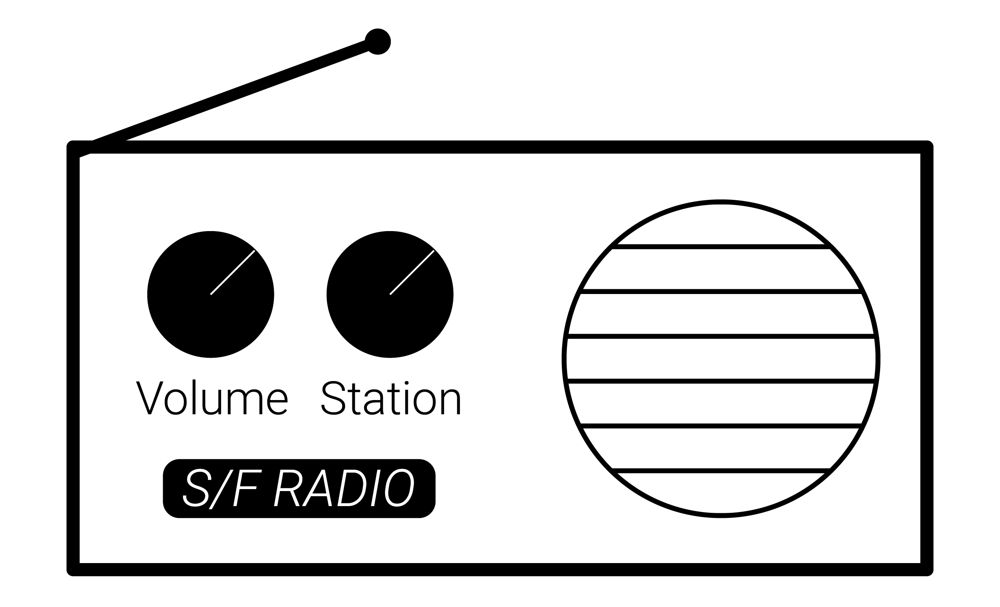

Modular synthesis is all about *inputs* and *outputs*.  You can think of the radio pictured here like a very simple "module."  It has a couple of inputs: a *volume knob,* a *station knob*, and some *radio waves* flying through the air towards the antenna.  It uses these inputs to create an output: the sound of a radio station at a certain volume traveling towards your ears!  The *volume knob* is an *control parameter* which controls volume.  The *station knob* is also a control parameter; it selects which *audio input* (the various radio waves) to listen to, i.e. it selects your radio station! 

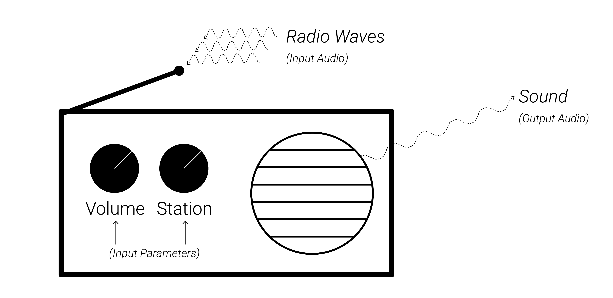

***Modules in a modular synthesizer do the same thing: they take in a series of inputs and produce an output (or multiple outputs!).   The output is created by applying set of rules to the various inputs.*** 

Let's consider this in the context of the radio first.  What "rules" does the radio apply to the *inputs* in order to produce an *output*?  

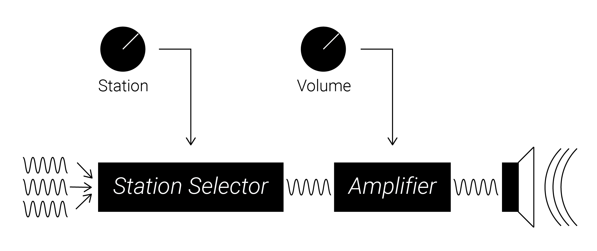

First, it receives lots of radio waves for different stations at its antenna.  Then it selects which radio station to listen to based off of the *station input parameter* This audio input is passed to an *amplifier*, which makes the incoming audio signal louder or quieter based on the position of the *volume input parameter*.  Once this final signal has been created, it gets sent to a speaker for our listening pleasure!  This "block" based diagram shows us the *signal flow*.  *Signal flow* describes the path signals (both *control* and *audio*) take as they flow through the system.  Individual *modules* or *processing blocks* receive input signals and create new output signals to pass along.   

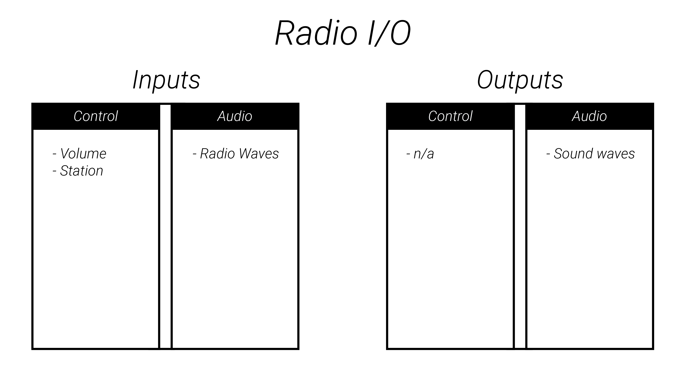

Notice that there are two qualitatively different types of inputs on our radio: *control* *inputs* (*volume* and *station*) and *audio* *inputs* (the various radio waves picked up by the antenna).  We only had one type of output, the *audio* *output* produced by the speaker, however other devices or modules might have *control* *outputs*.  For instance, a digital thermometer might measure the temperature of a room and then send the *control data* to another device for usage - that slowly-changing temperature-reading would be a *control output*.  This will be important in the context of modular synthesis, since many modules will *only* produce control data (for instance to control the pitch of a sound-generating module).

## 0.1 Patching: Modules, Signals, Input, and Output

In the context of modular synthesizers, an individual *module* is a device that accepts input signals and produces an output (or outputs) based off of the input signals.  Modules are installed into a single *rack* by connecting a power cable from the back of the module to the rack's power supply. The rack provides shared power to all modules and secures them together.  

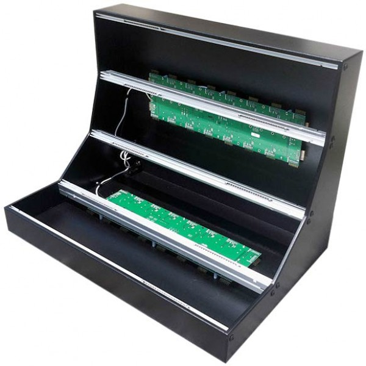

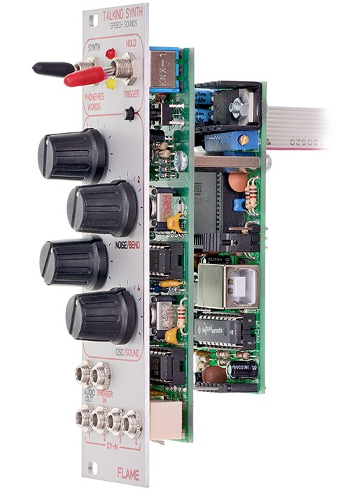

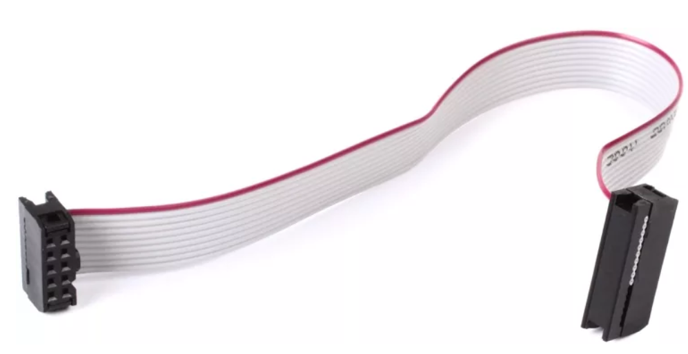

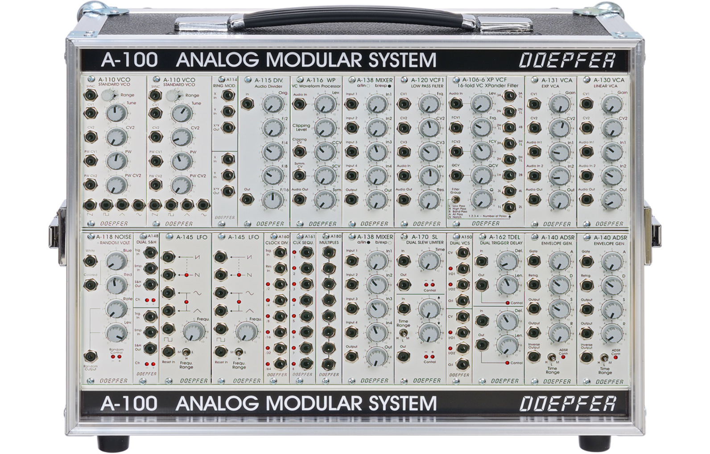

Each module provides its own functionality to the user.  The various operations performed by modules can be divided into three broad categories: 

1. Generating audio signals: e.g. a pure tone, a percussive noise, a rumbling bass, or even playing back a pre-recorded sound!
2. Processing or transforming audio signals: e.g. making a sound louder or quieter, brighter or softer, applying an effect like reverb, delay, or distortion.
3. Generating or transforming control signals that guide any other part of the process: e.g. sending signal to a tone generator to control its pitch, or sending signal to a sound processor to control how much it distorts an incoming sound, or sending signal to a sequencer to switch to a new pattern of notes.

*Modular* synthesis is all about designing your own arrangements of connections between modules as you build your own sound generating networks, or *patches*.  

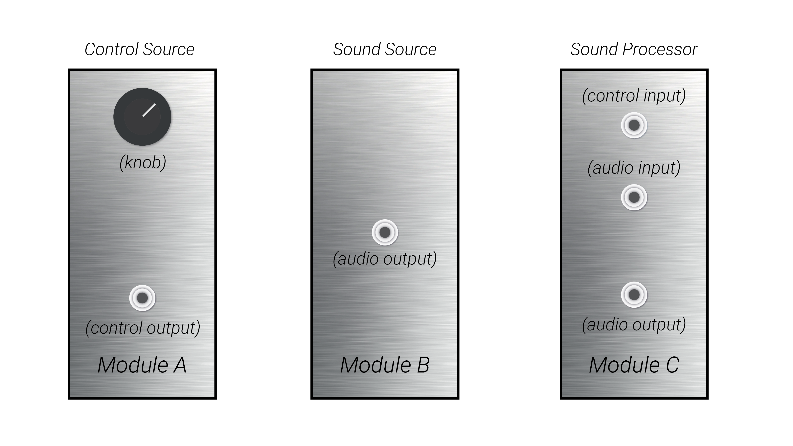

Some inputs may be electromechanical: *knobs*, *sliders*, *switches*, or even *touchpads* which you can control with your hands.  These elements are normally referred to as the *interface*, as they let you interact with the inner workings of the module in a performative or compositional manner; they are similar to the *volume* and *station* knobs from the radio example.  These electromechanical interface elements create *control signals* which each module uses internally to determine how to produce its output, just like the knobs on a radio.

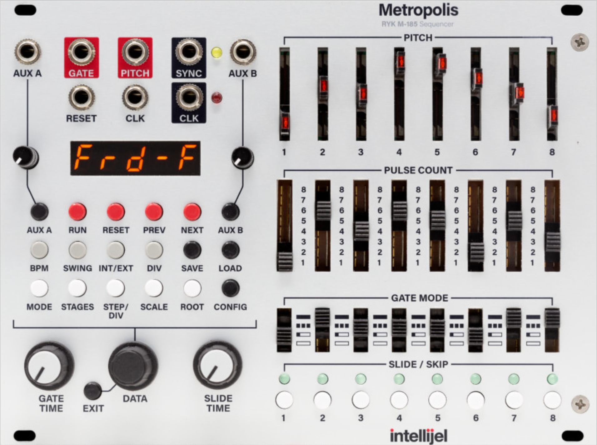

While sliders and knobs are great for performance and direct interaction, they are not unique to modular synthesizers.  What makes modular synthesizers unique are the *input jacks* and *output* *jacks*, which allow you to reconfigure how the modules send signals from one to another; this is done by connecting an output jack on one module to an input jack on another module using a *patch cable.*  When a patch cable connects two modules together, the source module outputs a signal from its jack which is sent over the cable to the connected input on the destination module.  Some inputs expect to receive an audio signal to process or transform, while other inputs expect to receive control signals.  

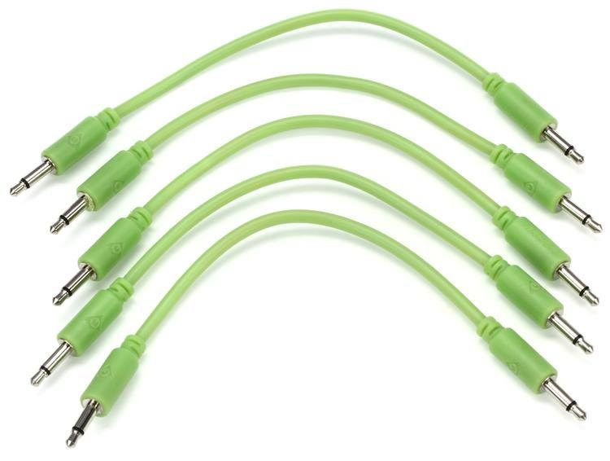

The cables are known as *patch cables* because they create a patchwork out of the modules.  A single cable *patches* (connects) an output from one module to an input on another module.  *In more advanced cases, outputs may even be self-patched to an input on the same module for feedback!*  

The process of patching is *modular* in nature: each module performs its own distinct operations on its inputs and outputs.  How you the user, choose to connect these flexible, modular processing blocks together is where the fun - and compositional challenge - lies!  A *patch* (noun) is a particular arrangement of the connections between a given set of modules.  A "patch" might make up an entire musical composition, or it might be used as a subcomponent of a larger patch - patches within patches!

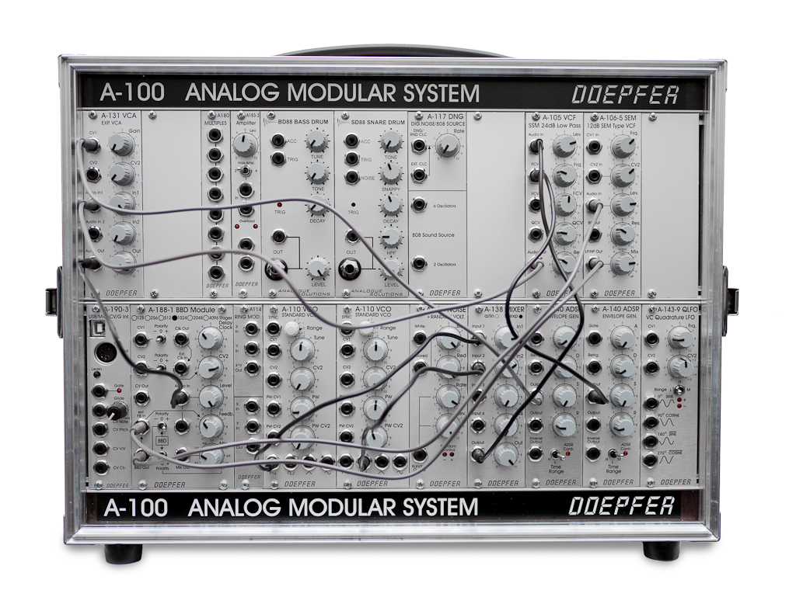

## 0.2 Voltage & Sound

So how are these mysterious *signals* being sent over the cables?  What exactly are they?  The signals that modules pass to each other via patch cables are *electrical* signals which are measured in *voltage*. 

All voltages have an *magnitude* and *polarity*.  Magnitude represents how big the voltage is.  Polarity means whether the voltage is positive or negative. For instance, at different points in time, an output might be sending out `+2V`, or `-7.4V`, or `+10.5V`.  These voltages all have different magnitudes, while two of them have the same polarity.  

Audio signals move up and down extremely fast, fluctuating up and down hundreds to thousands of time per second; we say that they change at *audio-rate*.  When we send an audio-rate voltage to a speaker, the speaker cone moves back and forth perfectly in sync as the audio-rate voltage moves up and down.  As the speaker moves back and forth, it pushes air back and forth; this creates sound waves in the air which reach our ears and vibrate our ear drum; our inner ear then recreates the same audio-rate electrical signal generated by the modular synthesizer and sends that signal along the cochlear nerve to our brain.  Our brains then, somewhat remarkably, phenomenalize the signal as *sound*.

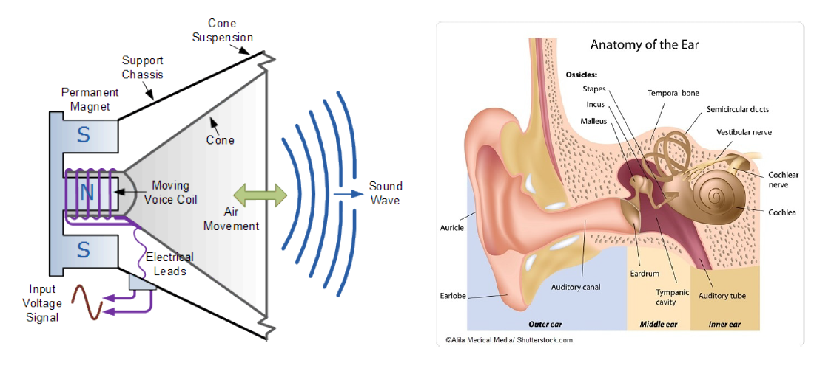

While audio-rate signals move extremely fast, control signals (aka *control voltage* or *CV* for short) change much more slowly - anywhere from a few milliseconds to tens of minutes - or they may even remain constant!  Control signals don't mean anything on their own - it all depends on what we connect them to.  For instance a control signal when patched to a sound generator might control the pitch of the sound generated; or, that same control voltage might control the loudness of an amplifier.

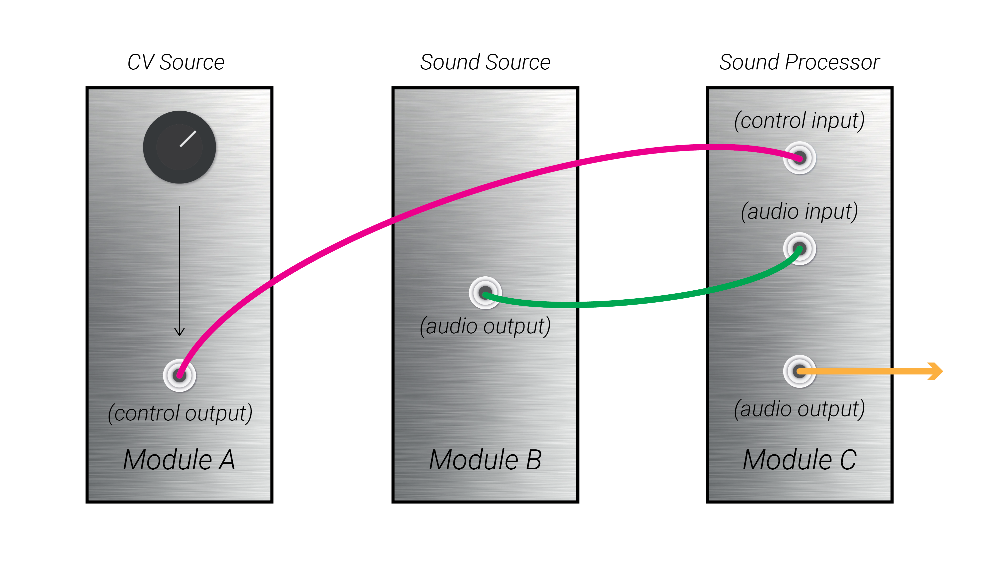

## 0.3 Modular Synthesis

Composing, performing, improvising, and experimenting with a modular synthesizer involves controlling various parameters of sound across across many different time scales.  Parameters of sound to compose with include (but are not limited to): Loudness, timbre, pitch, noise, space, density, harmony.  Control voltage tools like low-frequency oscillators, envelopes, sequences, and more are used to *modulate* these parameters, or change them over time.  Click the links in the following table to hear a few different types of modulation (LFOs, Envelopes, and Sequences) applied to the three core parameters of tonal sound (Pitch, Timbre, and Loudness). We will explore each type of modulation and each parameter in much greater depth throughout the course.  Come back once you have completed this class to read the previous sentence and enjoy the bad pun buried within it!

|              | LFO                                                          | Envelope                                                     | Sequence                                                     |
| ------------ | ------------------------------------------------------------ | ------------------------------------------------------------ | ------------------------------------------------------------ |
| **Pitch**    | [LFO applied to Pitch](https://www.dropbox.com/s/04kkwjqc0pvzxmb/pitch-lfo.wav?dl=0) | [Envelope applied Pitch](https://www.dropbox.com/s/ynvfxpgmd30o3us/pitch-envelope.wav?dl=0) | [Sequence applied to Pitch](https://www.dropbox.com/s/69mcoj4hf8ggxhs/pitch-sequence.wav?dl=0) |
| **Timbre**   | [LFO applied to Timbre](https://www.dropbox.com/s/a0mmldmlh3f0fxp/timbre-lfo.wav?dl=0) | [Envelope applied to Timbre](https://www.dropbox.com/s/amdnqaundukbf2k/timbre-envelope.wav?dl=0) | [Sequence applied to Timbre](https://www.dropbox.com/s/4mbglav19p98btg/timbre-sequence.wav?dl=0) |
| **Loudness** | [LFO applied to Loudness](https://www.dropbox.com/s/1qvhf0on97qemb1/loudness-lfo.wav?dl=0) | [Envelope applied to Loudness](https://www.dropbox.com/s/qw32hpao67k4oi6/loudness-envelope.wav?dl=0) | [Sequence applied to Loudness](https://www.dropbox.com/s/5fxa4pecb3wyhpd/loudness-squence.wav?dl=0) |

The different time scales to be considered when composing with a modular synthesizer may be broadly painted in three colors:

- Micro (shortest): Individual sonic events, ranging from a single grain of sound to a full-bodied note or a percussive strike.  From single strokes of a pen to letters to words.
- Meso (middle): Musical or sonic gestures, collections of micro events, textures, verses. From phrases to sentences to paragraphs.
- Macro (longest): Transformations across an entire composition or movement.  From paragraphs to chapters to books.

***The process of working with a modular synthesizer is the act of building a patch: connecting inputs to outputs and interacting with interface elements.  Audio and control signals flow from outputs to inputs.  Individual modules produce outputs based off the state of their various inputs, which may be a combination of electrical signals carried over patch cables and interface elements like knobs and faders.***  

So how do we actually do all this?  To build a patch - or analyze one - it iss important to be able to understand a few things:

1. *Transformation Rules*: What does each module do?  What kind of signal does it output?  How do the different inputs of a module affect the way the output is produced? 
2. *Signal Flow*: Which outputs are being sent into which inputs?  How do these connections affect each module?
3. *Signals*: What does a signal "look" like - is it moving fast? Slow? Is it constant?  Is it a repeating pattern? How large does it get?  How small?  Is it positive?  Negative?  How is the source module producing this signal?  How will the signal affect the destination module it is being patched into?
4. *Experimentation may involve stumbling in the dark*: Embrace it.  Enjoy it. See where it takes you, and don't stress if it's not where you expected/where you wanted.  You can always unpatch and start down a new path.

In the next series of lessons, we will start building up our collection of flashlights to see through the modular thickets.

## 0.4 Looking Ahead

| Chapter | Focus                                                        |
| ------- | ------------------------------------------------------------ |
| 01      | The basics of navigating VCV Rack; getting familiar with the concept of voltage; using an oscilloscope to visualize voltage. |
| 02      | The core building block of synthesis, the voltage-controlled oscillator; the concepts of frequency and amplitude; understanding how audio is transmitted as voltage; using low-frequency oscillators (LFOs) as control voltage to affect the pitch of audio-rate voltage-controlled oscillators (VCOs); using attenuators to scale both control- and audio-rate voltages. |
| 03      | Using voltage-controlled amplifiers to control the loudness of audio signals; amplitude. |
| 04      | Creating an *event* - something which has a beginning, middle, and end, through the use of envelope generators (EGs); triggers, gates, and clocks: the drivers of modular time. |
| 05      | Accurately controlling the pitch of oscillators using the volt-per-octave tuning standard, quantizers, and scales. |
| 06      | Using mixers to combine audio signals; using mixers to combine control voltage signals. |
| 07      | Sculpting the timbre of sound by controlling waveshape and using voltage-controlled filters (VCFs); the frequency domain and fourier analysis. |
| 08      | Techniques for creating rhythm out of clock streams.         |
| 09      | Utilities like sample+hold and slew limiting.                |
| 10      | Controlled randomness.                                       |