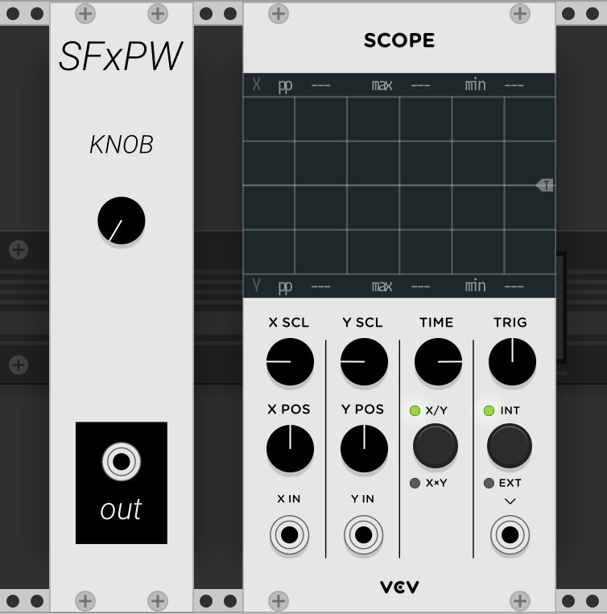
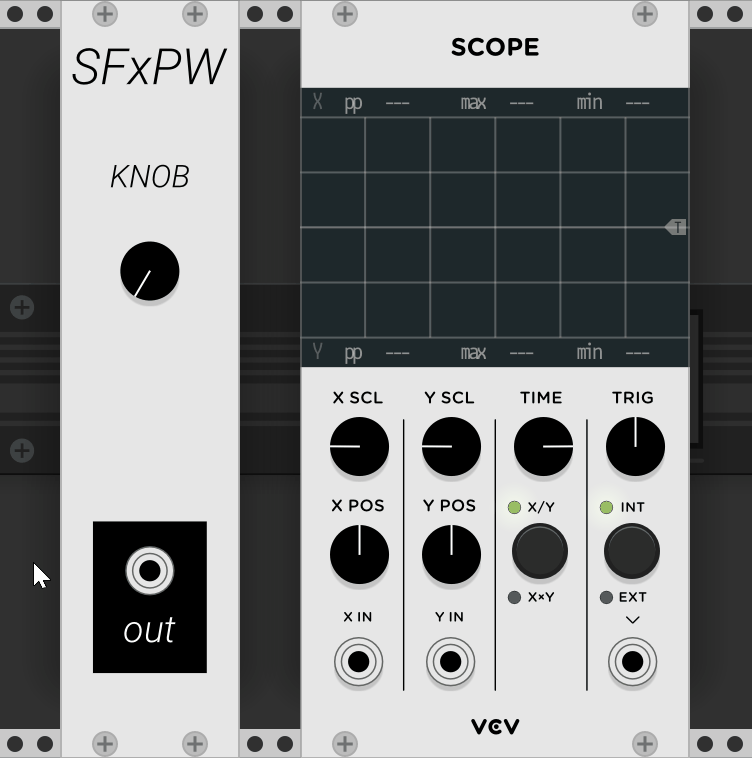
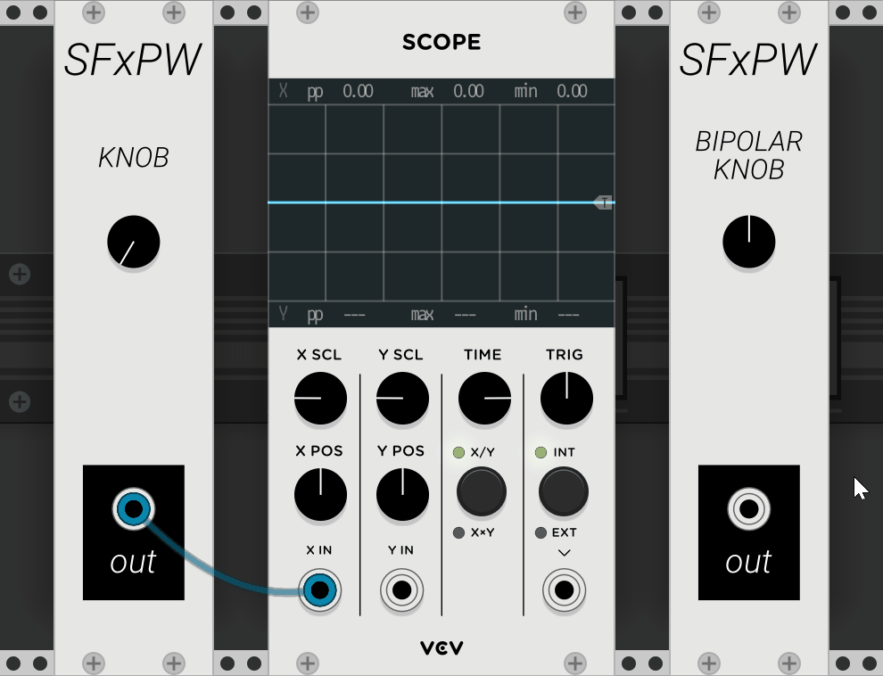

# Chapter 1: Introduction to VCV Rack and Generating Voltage

This chapter will teach you how to use the oscilloscope as a tool for understanding signals, how a few fundamental building block modules generate and process signals, and help you become comfortable patching modules together in *[VCV Rack](https://vcvrack.com)*, an open-source digital environment which closely emulates Eurorack-format modular synthesis (including direct ports of many analog and digital Eurorack modules).  

To start, we won't focus too much on the *musical* utility of the various ingredients for modular synthesis.  Instead, we will focus on understanding how they work abstractly so you can build intuition for what they are actually doing, and gain a basic understand of how voltage is turned into sound.  You have to walk before you can run!

While VCV Rack is a digital environment, we will continue to talk about the signals as analog voltages, since the environment is designed to emulate Eurorack modular synthesis.

## 1.0 Tabula Rasa

1. Download and install the latest version of VCV Rack [here](https://vcvrack.com/rack.html)
2. Open up VCV Rack.  You should see several modules on the screen already patched together - it's okay if it looks overwhelming! We will be starting from the beginning and building our way up to this. We have to wipe the slate clean to do that...
3. Move your mouse so that it hovers over each module and press `Backspace` or `Delete`. Your screen should now be blank.
4. Hit `File > Save Template`.  A dialog box will ask you to confirm that you would like to overwrite the template patch.  Press `OK`.  Now whenever you create a new patch in VCV Rack (`File > New.` or `Ctrl/Cmd + N`, you will have a blank slate to work from.
5. If you have not done so already, log in to the Signal/Flux VCV Rack account using the username `itms@signalflux.org` and the password `synthesis`.  Login details can be entered by opening the `Library` toolbar menu. 
6. Once you have logged into the account, hit `Library > Update Plugins` to download a library of modules which we will be exploring in this class.  It will take a few minutes to update.  
7. Right-click, or `Alt/Opt-Click`, anywhere in the blank Rack to bring up the module browser. 
   1. Type the name of a module to search for it.
   2. Or, select a category of modules by typing in the tag name (e.g. `Oscillator` or `Envelope Generator`).  
   3. You can also browse by the names of the various installed module brands packages (VCV Rack calls them *plugins*).  
   4. No need to add any right now, but it is good to take a quick look around!

## 1.1 Oscilloscopes and Voltages

In this first lesson, we will look at a critical tool for understanding *signals*: the *oscilloscope*.  An oscilloscope allows you to visualize the voltage level of a signal in order to understand how the signal is actually changing over time.  Understanding how a signal changes over time is critical to understanding how the signal is affecting any of the other modules it might be connected to.  We will also look at a simple signal generator module which outputs a constant voltage.  The magnitude or *level* of the constant voltage can be set by a knob.

So, let's begin!

### Generating and Viewing Basic Voltages

1. Open up a blank VCV Rack.
2. Add the **Scope** module (found at `Fundamental > Scope`).
3. Add a **Simple Knob** module (found at `Signal Flux > Simple Knob`). Notice that its default (or "initial") position is fully counter clockwise.
4. Connect the **Simple Knob**'s only output to the Scope's first input, labeled `X In`.  To do so, hover  your mouse over **Simple Knob**'s output jack; then press and hold your mouse to insert one end of a cable into the jack.  While still holding the mouse, drag away from the jack - the other end of the cable is now stuck to your mouse!  Bring your mouse to the correct input on the **Scope** - once the end of the cable is hovering over the input, release the mouse to drop the other end of the cable into the correct jack! 
5. What happens on **Scope**'s screen when you first connect the output of **Simple Knob** to the `X in` input of **Scope**?
6. Adjust the only knob on **Simple Knob** by clicking it and dragging your mouse up and down.  Clicking a knob and dragging your mouse up will turn the knob clockwise (CW), while clicking and dragging down will turn the knob counterclockwise (CCW).  Double-clicking any knob will restore it, or *initialize* it, to its default position.
7. What happens to the line on **Scope**'s screen as you turn the knob clockwise (CW)?  What happens when you turn the knob counter-clockwise (CCW)?
8. What do you think the **Scope** is displaying?  What do you think **Simple Knob** is doing?
9. Now, add a **Bipolar Knob** (found at `Signal Flux > Bipolar Knob`) and send its output into the input jack on **Scope** labeled `Y In`.  Notice that its initial position is different than **Simple Knob**'s default. 
10. Repeat steps (7) and (8) with the **Bipolar Knob**.  What was the same? What was different?  What do you think is the difference between the two modules?  
11. The `Blue` trace (horizontal line) on the scope always corresponds to the `X In` signal, and the `Pink` trace on the scope always corresponds to the `Y In` Signal.
12. Do you notice any correspondence between the knob positions, the blue/pink lines on **Scope**, and the matching numbers next to `X max` and `Y max` above and below the **Scope**'s display screen'?
13. What are the highest the numbers next to `X max` go?  `Y max?`  How high can the blue and pink lines go?

The output jack of each module is sending out a constant voltage that directly matches the value of the corresponding knob, however their *ranges* are different: 

- The **Simple Knob** outputs 0V when the knob is at its minimum, counterclockwise; +5V when the knob is at noon (middle); and +10V when the knob is at its maximum, clockwise.
- The **Bipolar Knob** outputs -5V when the knob is at its minimum (CCW); 0V when the knob is at noon; and +5V when the knob is at its maximum (CW).

We say that the voltages output by the two modules are *constant* because it stays at the same level, so long as we do not change the knob position. These constant voltages are known as *DC offsets*, or just *offsets*.  We will discuss why they are called this later in more detail, but for now, it is enough to consider that adjusting the knob just seems to *offset* the voltage up and down. We say that the **Simple Knob** is *unipolar* because it only outputs positive voltage, while the **Bipolar Knob** is *bipolar* because it outputs both positive and negative voltage.

What about **Scope**? What does it do? As indicated by the root word "scope", oscilloscopes visualize voltages that change over time.  The X-axis of the oscilloscope screen is time, while the Y-axis is the voltage level.  The top half of the screen corresponds to positive input voltages, and the bottom half of the screen corresponds to negative voltages.  Each trace represents the level of the input voltage - the higher the trace, the higher the input voltage!

When the input voltage is not changing, **Scope** will just display a flat line at the height of the input voltage.  When a voltage increases, the line tracing the voltage moves up.  Similarly, if the input voltage decreases, the level of the line moves down.

When the input voltage changes, older values are displayed on the left of the screen, and newer values are displayed on the right.  In other words, **Scope** will write the incoming voltage values onto the screen from left to right.  Once it reaches the right edge of the screen, it will either erase the whole screen and start over on the left side, or it will just reset to the left side and begin writing from left to right, leaving the old values in place until it overwrites them.

### Oscilloscope Time Scales

1. Turn **Scope**'s `Time` knob down to its minimum value (fully CCW).  
2. Now adjust one of your **Simple Knobs**' knob slowly in both directions, and then quickly in both directions.  Play with each knob for a while, observing the scope the whole time.  Record your observations.  
3. As you play with the knob, observe the color of the ends of the corresponding cable where it enters the output and input jacks.  How does the color relate to what you see on the **Scope**?
4. Turn **Scope**'s `Time` knob back to its maximum value (fully CW).  Now play with the **DC Gen** knobs again, and record your observations.  
5. Try other intermediate settings for **Scope**'s `Time` knob, playing with **DC Gen**'s knobs and recording your observations the whole time.
6. Turn **Scope**'s `Time` knob back to its minimum, and play with **DC Gen**'s knobs one last time.
7. How does the behavior of **Scope** differ depending on where the **Time** knob is set?
8. What do you think the **Time** knob does?

Before you read further, take some time to really reflect on steps 7 and 8. 

The **Scope**'s `Time` knob determines the scaling of the X-axis in the oscilloscope viewfinder; since the X-axis is just time, the `Time` knob thus determines the window of time for which you can see voltages on the **Scope**.  In other words, it determines how long it takes for the **Scope** to write values across the entire screen from left to right, before having to reset and start over on the left hand side.  As `Time` turns clockwise, it takes less and less time to complete a single frame, meaning you can't see as far back into the past, but you can see very fast changes much more clearly.

Alternatively, you can think of the `Time` knob as determining how frequently the **Scope** completes a single frame.  The greater the value of `Time`, the greater the frequency at which it completes a frame (which is the same as saying it takes less time to complete a single frame).  

`Time` allows you to zoom in and out along the X-axis, giving you better understanding of how voltages are changing in the microscopic, mesoscopic, and macroscopic scales.  If you imagine a time line of history with important events marked on it, this knob determines if the scale of the timeline you are observing is geological eras, millenia, centuries, months, weeks, days, hours, minutes or seconds!  The more zoomed in you are, the easier it will be to see very quick changes, but the harder it will be to see changes across longer time scales. Try repeating the steps above with this in midn.

We will cover the other parameters of a **Scope** in subsequent lessons.

In addition to using the oscilloscope to view the level of a voltage, VCV Rack conveniently displays a color at either end of a cable to visualize the voltage, as indicated by step (3) above.  When the color is green, it indicates the cable is carrying a positive voltage.  When it is red, indicates the cable is carrying a negative voltage.  The brightness of the color corresponds to the magnitude.

## 1.3 Low Frequency Oscillators and Voltage Polarity

In this lesson, we will look at a module which generates a voltage that varies over time on its own: the Low Frequency Oscillator. 

### LFOs

1. Add an **LFO-1** module to the patch from 1.1 (found at `Fundamental > LFO-1`).
2. Disconnect the cable that goes from **DC Gen**'s first input to **Scope**'s `X In` by clicking one end of the cable and dragging it to empty space - simply release the cable while one side is not hovering over an input to disconnect it.  You can also simply right-click a cable to delete it.
3. In fact, go ahead and delete **DC Gen** entirely!  Simply hover over it with your mouse and press `Delete` or `Backspace` on your keyboard.
4. Now connect **LFO-1**'s `Sine` (abbreviated on the panel as `Sin`) output to the same **Scope**'s unused `X In` input.
5. What do you see on the **Scope** viewscreen?  How is the color on the end of the cable connecting **LFO-1** to the **Scope** changing?
6. If you can't see multiple cycles of the LFO's waveform, use your new skills to adjust `Time` until you can see about four cycles of the waveform.  Before adjusting it, reflect on which direction the knob must turn in order to zoom in or out.

A *low-frequency oscillator*, or LFO, generates a voltage that changes over time in a periodic (aka repetitive) fashion.  The pattern of how the voltage changes over time stays the same, and is called the *shape* of the oscillator.  The repetition of this pattern is known as an *oscillation*.  An oscillator just generates oscillations!   The height, or maximum level of these oscillations, is known as the *amplitude*.  The duration of time it takes to complete one cycle of this pattern is called its *period*.  The number of cycles it completes per second is called its *frequency*, and is measured in *Hz* (1Hz = 1 cycle completed per second).  An LFO then is just an oscillator that produces a voltage which changes in a pattern at a very slow rate - this makes it ideal as a *control voltage*, or *CV* source for controlling parameters of other modules!  We will cover using an LFO to control other modules as well as how adjusting the various parameters of an LFO affects the output waveform in subsequent lessons.  

### Bipolar vs Unipolar Voltages

1. Click the `Uni/Bi Switch` back and forth, while observing the waveform in the viewfinder.  Record your observations.
2. Finish by resetting the switch to `Uni`.
3. What do you think the LFO
4. What do you think `Uni` and `Bi` mean about the waveform?

`Uni` stands for *Unipolar* while `Bi` stands for *Bipolar*.  

Unipolar waveforms are always greater than or equal to `0V`, or always less than or equal to `0V`, but they can never be both positive and negative.  They have one direction (or pole) which they can move towards from 0V, either positive or negative, but not both.

Bipolar waveforms can vary around either side of `0V`, meaning they can go back and forth between being positive and negative.  

## 1.3 Attenuverters, Multing & Normalling

In this lesson, we will explore your first tool for processing, i.e. shaping and transforming, a voltage: the attenuverter.  We will also learn about how to patch one output to multiple destinations inputs (*multing*) and the concept of *normalled* connections.

### Attenuverters and Multing

1. Add an **8Vert** module (found at `Fundamental > 8Vert`) to the patch from 1.2.
2. Delete the patch cable connecting **DC Gen**'s second output to the `Y In` on **Scope**.
3. Connect **8Vert**'s first output to the jack labeled `Y In` on **Scope**.
4. Now, we will connect the `Sine` output of **LFO-1** to **8Vert**'s first *input*.   Previously, we have made connections by clicking an output and then dragging the cable to the destination input.  If we try clicking and dragging **LFO-1**'s `Sine` output jack though, it will move the cable that is already there.  We want to be able to send the same output LFO signal to two places at once; this is known as *mult*-ing a signal, because we are creating *multiple* copies of it.  In VCV Rack, this can be done by simply plugging the cable into the destination input jack first and then connecting the other end of the cable to the source output jack which already has a cable inserted into.  In this case, that means clicking and dragging the mouse from **8Vert**'s first input to **LFO-1**'s `Sine` output.  Now you should have two cables coming out of **LFO-1**'s `Sine` output - one going to **8Vert**'s first input, and one going to the `X In` jack on the **Scope**.  
5. Since the output of **8Vert** is connected to the `Y In` jack on the **Scope**, we are able to compare how the original LFO looks (via the `X In` jack) to how it looks after it is processed by **8Vert** (via the `Y In` jack).
6. Slowly sweep **8Vert**'s first knob clockwise.  Observe what happens in the **Scope** window, and record your observations.  What happens when the knob reaches its maximum position, fully CW?
7. Slowly sweep **8Vert**'s corresponding knob counter-clockwise.  Observe what happens in the window, and record your observations.  What happens when the knob reaches noon.  What happens when the knob crosses over noon, into the counter-clockwise half?  What happens when the knob reaches its minimum, fully CCW?  How does green/red voltage indicator color of the cable going into **8Vert** compare to the color of the cable coming out of **8Vert**?
8. Describe how the knob affects the incoming signal in as much detail as you can.  What do you think it is doing mathematically to the incoming signal? 
9. Are there any parts of the waveform which always occur in the same place, no matter the position of the **8Vert** knob?  
10. Put **LFO-1** into `Bipolar` mode using the switch.  Repeat steps (6)-(9).
11. What do you think **8Vert** is doing to the signal? Mathematically?  Visually?

It seems as if the attenuverter is controlling the amplitude - or vertical scaling - of the input LFO waveform, as well as its polarity.  When the knob is at noon, the output of the attenuverter is 0V.  It's as if nothing is getting through the attenuverter.  

As the knob turns CW, the input waveform begins squeaking its way through the attenuverter to the output, just at a lower amplitude (height).  The more the knob increases, the greater the amplitude of the output waveform.  Eventually, when the knob reaches its maximum, the **8Vert** output waveform precisely matches its input waveform.  

When the knob is turned CCW, the amplitude decreases back to zero.  When it hits noon, nothing makes it through.  Turning it further CCW past noon, the output of **8Vert** becomes a mirror image of the input waveform, reflected across the X-axis: positive voltages have become negative, and negative voltages have become positive!  

Whenever the input voltage is `0V`, it stays at `0V`, regardless of the position of the knob.

As such, this input, knob, and output are together called an *attenuverter*, because they have two abilities: they can attenuate a signal (make it proportionally smaller, or closer to zero, while keeping its same shape), and they can invert a signal (flip the signs of all voltages).  

Mathematically, this is quite simple to express by assigning the knob a value between `-1` and `1`, depending on its position.  Fully CCW, the value of the knob is `-1`.  At noon, the value of the knob is `0`.  Fully CW, the value of the knob is `1`.  The equation that relates the input to the output is as follows:
$$
Output = Input \times Knob
$$

- When the knob is at noon, the value of the knob is `0`, so `Output = Input * 0 = 0` meaning, the output is 0V at all times, regardless of the input.  It's as if the input signal is completely blocked.
- When the knob is fully CW at its maximum, the value of the knob is `1`, so `Output = Input * 1 = Input` and the output signal is thus identical to the input signal at all times.
- When the knob is fully CCW at its minimum, the value of the knob is `-1`, so `Output = Input * -1 = -Input` and the output is thus identical to the input at all times, but all negative voltages become positive and all positive voltages become negative - its like a mirror image over the X-axis.
- When the knob is halfway between noon and fully CW, it is as if the value of the knob is `0.5`, so `Output = 0.5 * Input`, and the so the output will always be half as large as the input voltage!

The **8Vert** module is named as such because it is just 8 independent attenuverters!

Attenuverters play an understated but critical role in modular synthesis, as they allow you to bend and sculpt your control voltages.  

Sometimes you need to just set-and-forget an attenuverter so that your modulation depth is exactly how you like it.  For instance, an LFO might be outputting a voltage which varies between `-5V`and `+5V`, but a destination input might expect signals that vary between `-2.5V` and `+2.5V`.  An attenuverter could solve the issue for you! 

In other scenarios, you might use attenuverters as dynamic, performative controls.  For instance, let's say you want to use an LFO to sweep the pitch of another sound up and down; sometimes you might want the LFO to sweep the pitch of the sound over a very wide range, while other times, you might want the LFO to only sweep the pitch by a very small amount.  An attenuverter could let you set the depth of the pitch sweep to different amounts by attenuating the LFO into a smaller or larger range!

### Normalled Connections

1. Set the attenuverter knob to noon by right-clicking it (or alt-clicking it). 
2. Disconnect the cable going to the attenuverter's input.
3. If you were to adjust the attenuverter knob now, what would you expect to happen, based off the last section?  Think about what is going into the attenuverter input jack (nothing).  Think about the equation that determined the output voltage based on the input voltage (no input cable = 0V).  
4. Now try sweeping the attenuverter knob, back and forth, and observe what actually happens.

The voltage coming out of the attenuverter is behaving just like the offsets generated by **DC Gen**!  How is this possible?  If the input is `0V`,and we know that `Output = Input * Knob`, then `Output = 0V * Knob = 0V`.  So shouldn't the output just be `0V` at all times, not moving up and down like an offset generator controlled by the knob?  

You are right - if the input was actually `0V`, then the output would always be `0V`, regardless of the attenuverter knob position.  However, this module is ~special~, and I tricked you a little bit!  Sorry!  On most modules, when nothing is plugged into a jack, it is the same thing as sending `0V` into the jack.  However, for some modules, it is as if there is a "default" voltage sent into the jack that is used when nothing is plugged in.  As soon as you plug something into the jack, the default voltage gets ignored and the input voltage that was just connected takes over.  However until then, when nothing is plugged in, this default voltage is treated as the input.  

This is known as *normalling*.  This default voltage is said to be *normalled* into the input jack.  Plugging a cable into the jack *breaks the normalled connection* - sometimes we will simplify this by just saying that it *breaks the normal*.  When the normal is broken by a cable, the default normalled voltage just gets replaced with whatever is being sent into the jack via the new cable.

In the case of **8Vert**, there is a `+10V` offset *normalled* into every input jack.  So when nothing is plugged into one of the attenuverter's inputs, it is as if the attenuverter is acting on a `+10V` offset, instead of acting on `0V`.  Now, the observed behavior should make sense!  When the knob is fully CW, the output will then be `+10V`.  When the knob is halfway between noon and fully CW, the output will be `+5V`.  When it is at noon, the output will be `0V`.  When it is fully CCW, the output will be `-10V`.  This allows each of the attenuverters of **8Vert** to act as offset generators when nothing is patched into them!  

Whenever you begin using a new module, it is important to understand which connections have signals normalled into them, and which don't!  For instance, it is common for the one input jack to be normalled into another input jack.  This means that whatever signal is connected to the first input will also be sent into the second input without the need for using a second cable to mult it in to the second input!

As an exercise, without using VCV Rack, predict what the result of the following patch will look like!

- **8Vert** channel 1 has no input cable
- **8Vert** channel 1 knob set to fully CCW
- **8Vert** channel 1 output > **8Vert** channel 2 input
- **8Vert** channel 2 knob set to to halfway between noon and fully CCW
- **8Vert** channel 2 output > **Scope** `X-in`
- What will the scope look like when you first connect the signal to it?
- What will happen as you sweep the channel 1 knob?
- What will happen as you sweep the channel 2 knob?  Will it be the same as channel 1 knob, or different?

Once you've made your predictions and written them down, patch it up and see what happens!

## 1.4 Getting Audio from VCV Rack

1. Clear all patch cables by pressing the `Cat` icon in the toolbar.
2. Add an **Audio** module to your patch (found at `Fundamental > Audio`).  This module will be used to send sound to your sound card.
3. Select the appropriate sound card by clicking the **Audio** module's LCD displays first and second rows.
   1. If you are on a Mac, you will select `Core Audio` for the first row, and your desired sound card for the second row (e.g. Built-in Output, Motu 828x, etc.).
   2. If you are on a PC, you will need to select the desired driver in the first row (likely `ASIO` if you are using an external audio interface, or `DirectSound` if you are using your computer's onboard sound-card), and then the appropriate sound card for the second row.
4. Add a **VCO-1** to your patch (found at `Fundamental > Audio`).
5. Set the attenuverter for an unused channel of **8Vert** to noon by right-clicking it.
6. Patch that attenuverter channel's output to **Audio**'s first input, marked `1`.
7. Patch the `Sine` output of **VCO-1** to the attenuverter's input.  
8. Slowly increase the attenuverter knob.  You should hear sound from your left speaker, increasing in volume as you increase the knob!  Think back to the lesson on attenuverters, and try to explain why! Hint: amplitude.  It's okay if you don't know, we will discuss more in the next lesson - we just want to make sure your speakers are working right now!
9. Reset the attenuverter knob to noon by right-clicking it.
10. Switch the cable going from **8Vert** to **Audio** by unplugging it from **Audio**'s `1` input and plugging it into `2`.
11. Repeat step 8 - audio should come from the right speaker this time.

The **Audio** module lets you route audio to and from your sound card into VCV Rack.  Input signals to your audio interface like hardware synthesizers or microphones will show up in VCV Rack at the `Output 1-8` jacks on the **Audio** module.  Audio from VCV Rack to be sent out of your audio card should be sent to the VCV Rack `Input 1-8` jacks - these connect to your speakers.

## 1.5 Introduction to Oscillators: Frequency, Amplitude, Waveforms & Modulation

In this lesson, we will explore how sound is generated by using oscillators.  We will discuss how the amplitude, frequency, and shape of an audiorate oscillation control the loudness, pitch, and timbre of a sound.  Additionally, we will explore using slow oscillators, or LFOs, to generate *control voltage*, or *CV*, that controls parameters of another module for the first time.  This is known as *modulation*.

### Oscillation: From Control Rate to Audio Rate

1. Clear all patch cables by pressing the `Cat` icon in the toolbar.  You should have an **8Vert** module, an **LFO-1**, a **Scope**, and an **Audio** module at this point.  
2. Connect the output of a signle attenuverter on **8Vert** to both `Input 1` and `Input 2` on the **Audio** module, as well as the `X In`  jack of the **Scope**.  If you don't remember how to connect one output to multiple inputs, review the first few steps of lesson 1.3's section on *multing* a signal.
3. Set the attenuverter to noon by right-clicking it, if it is not already at noon.
4. Set the `Time` knob on the **Scope** to noon.
5. Set **LFO-1** to `Bipolar` mode.  Patch the `Square` output of **LFO-1** to the input of the attenuverter.  
6. Slowly turn the attenuverter clockwise towards its maximum.  What do you hear and see?  
7. Slowly turn the `Frequency` of **LFO-1** clockwise.  What happens to the clicks?  At what point do you start discerning a pitch?  What happens to the waveform visually as you adjust the`Frequency` knob?  What happens to the pitch?
8. Turn the knob counterclockwise.  What happens to the waveform visually?  What happens to the pitch?
9. Reset the `Frequency` knob to noon by right-clicking it.
10. Repeat steps 5-9, but first move the cable coming from the `Square` output of **LFO-1** to `Saw`.  Then do the same thing with the `Triangle` output, and then `Sine`.  Each time, adjust the attenuverter, moving it between noon and fully clockwise.  How does the waveform change visually?  How does the sound change?

Oscillators are simply modules which produce signals that go up and down in a repetitive pattern over time, as discussed in the previous introduction to LFOs.  Before though, we did not actually do anything with this voltage that went up and down.  Here though, we patched it to a speaker, and eventually heard sound once the frequency got high enough.  As the frequency of the oscillation increased, the pitch of the oscillator went up, and the waveform seemed to compress on the scope, as more and more cycles completed for each frame that the scope drew. As the frequency of the oscillation decreased, the waveform seemed to stretch out, and the pitch decreased.  The attenuverter seemed to control the volume of the signal.

All tonal material - i.e. sound material that seems to have a pitch, is characterized by a repeating waveform which pushes air back and forth.  This is precisely what vibrating vocal chords do.  Similarly, the vibrating string of an acoustic guitar transfers its vibrations to the body of the guitar via the bridge, which then amplifies those vibrations in its cavity, and emits the vibrating sound waves out of the sound hole.

When we patch a repeating waveform voltage to a speaker, the voltage pushes a magnet back and forth precisely in sync with the repeating waveform pattern.  The magnet then pushes a speaker cone back and forth, which in turn pushes air back and forth.  The higher the voltage sent to the speaker, the further the magnet pushes the speaker cone from its resting position at `0V`.  The more negative the voltage, the further the magnet pulls the speaker cone in from its resting position.  The oscillating voltage waveform is *transduced* into an oscillating kinetic waveform - i.e. the motion of the speaker cone moving back and forth.  This kinetic waveform in turn is transduced into an acoustic waveform as the speaker cone pushes air - i.e. a waveform that travels through the air as compressions and rarefactions of air molecules.  This acoustic waveform eventually hits your ear drum

Your ear drum then gets pushed back and forth in sync with the original electrical waveform, and your inner ear transduces this motion back into an electrical signal which travels along nerves to your brain, which then, quite magically, you phenomenalize as the experience of sound.

In order for sound to be audible, the air must be vibrating very fast.  For instance, if I high-five the air in front of you, you won't hear the sound of my hand pushing air towards you.  If I push my hand forwards and backwards as fast as I can, you still won't hear it.  If I clap once, you will hear a percussive burst which corresponds to a single wave of compressed air molecules traveling towards you, however you won't hear any pitched sound - this is because the intensity of the wave is strong enough to push your ear drums in very fast and generate a sharp electrical transient in your inner ear, but because it is not a repeating compression and rarefaction of air, you don't hear a pitch.  The harder I clap, the greater the intensity of the sound wave, and thus the louder the sound.  Explosions then are just like really loud claps!

Think back to the experiment at the start of this section - at low frequencies, you just heard a click from the speaker cone moving position very sharply and pushing a column of air abruptly, similar to a clap.  However, once the frequency of the LFO became fast enough, these repetitive compressions of air became frequent enough to merge the clicks into a pitched tone.  As the frequency went higher and higher, the pitch went higher and higher.  Remember, *frequency* just means the number of times an oscillation repeats one cycle of its waveform per second, and it is measured in *Hertz* (1Hz = 1 repetion per second). 

For humans, the point at which oscillations become audible as pitched sound is about 20Hz, or 20 cycles-per-second (i.e. if a click happens 20 times per second, you will hear it as a tone, rather than as a sequence of transients).  Oscillations below that rate cannot be heard as pitches, but they are certainly useful for controlling parameters of other modules, like volume, or even frequency of another oscillator!  Voltages which change slower than 20Hz are typically said to be *control voltages*, or *CV*, which change at *control rate*, due to their usefulness in controlling other parameters on your synthesizer!  Voltages which oscillate faster than 20Hz are typically said to be at *audio rate*.  The edge of human hearing is somewhere between 15kHz and 20kHz (*NB: 1kHz = 1000Hz*), depending on age and other hearing loss factors.  

What determines the loudness of a sound?  Well, we said before that the difference between a clap and explosion was just the intensity with which a single pulse of air is generated.  For oscillations, the height of the waveform determines how far forward and backward the speaker cone moves, which in turn determines the intensity with which air is pushed forwards and backwards.  The greater the height of an audiorate waveform, the louder it will be as a sound!  The height of a waveform is known as its *amplitude*, and is typically measured in *Vpp*, or "peak-to-peak voltage".  This just means the distance from the most positive voltage that the waveform reaches to the most negative voltage the waveform reaches.  Now that you understand amplitude, think about why the attenuverter controlled the volume of the sound you heard!  When you patch an oscillator through an attenuverter, the knob just controls the amplitude of the waveform without affecting its frequency or shape, and so it simply controls the volume!

A **VCO**, or *Voltage-Controlled Oscillator* is just a module which generates voltages that repeat periodically over time.  It is said to be *voltage-controlled* because it will have inputs which allow you to use voltages from other modules to control various parameters of the repeating patterns, like the frequency of the waveform.  Oftentimes, oscillators will have multiple different outputs, each with its own fixed waveforms (i.e. different patterns of repeating voltages) like **VCO-1**.  Sometimes though, oscillators will have a single output with different knobs and voltage-controls for changing the shape of the output waveform.   The shape of an audiorate waveform will affect the quality, or *timbre*, of the sound produced, but will not affect the pitch - remember, pitch is only determined by frequency of oscillation.

An **LFO**, or *Low-Frequency Oscillator*, is just a VCO that is meant to run at slower rates ideal for generating control voltage.  Although an LFO is typically used to control parameters of other modules, most LFOs can go fast enough to become audible when patched to a speaker, as demonstrated in the experiment above!  **LFOs** are just like special **VCOs** that are just designed to go slowly, while **VCOs** are designed to go fast enough to be heard.  

Another special feature of many **VCOs** is that you can carefully send input voltages to them to precisely control their frequency - this allows you to play tonal (or microtonal!) sequences of notes, which is typically desirable in producing many different styles of sound art and music.  

Audiorate oscillations are almost always centered around 0V, making them bipolar, so that 0V corresponds to the speaker cone resting in its normal position, positive voltages represent pushing the speaker cone forward from its resting position, and negative voltages correspond to pulling the speaker cone back from its resting position.  **LFOs** may be bipolar or unipolar, depending on the particular module and use case.

Try going back and repeating the exercise at the start of this lesson, this time trying to predict what will happen at each step.  

### Oscillator Waveforms & Using Voltage as Modulation

In this lesson, we will explore using modulation for the first time!  We will use the slowly moving voltage of an LFO to modulate the the pitch of another VCO!

1. Remove the patch cable connecting **LFO-1** to **8Vert**, and set the attenuverter knob to noon by right-clicking it.
2. Set **VCO-1** to `DIGI` on the `Digital/Analog Switch`.  Connect the `Sine` output of **VCO-1** to the now-empty input on **8Vert**, and increase the corresponding attenuverter knob slowly.  What do you hear?
3. Adjust `Time` on the **Scope** so you can see about 10 cycles of the waveform clearly.
4. How can you change the amplitude of the oscillation with the current patch?  
5. Listen to each of the four outputs of **VCO-1** by relocating the patch cable to the `Triangle`, `Sawtooth`   and `Square` outputs. Describe how the outputs change visually and aurally.  Which waveform sounded the brightest?  Which waveform sounded the purest?  Which was the harshest?  Which waveform looked the most round?  Which had the sharpest transitions?  Do you notice any parallels between the aural quality (*Timbre*) and the waveforms' shapes?  
6. Finish with the `Sine` output of **VCO-1** connected to the attenuverter.
7. How will the waveform of **VCO-1** change ad you adjust the `Freq` knob of **VCO-1**?  How will the sound change?  Try it! Reset the knob to noon when you are done by right-clicking it.
8. Set **LFO-1**'s frequency to about 9 o'clock, and the `Unipolar/Bipolar Switch` to `UNI`.
9. Before completing this next step, try to predict what will happen aurally and visually: connect the `Sine` output of **LFO-1** to both the `Y In` jack on the scope and the `FM` jack on **VCO-1**.  `FM` stands for *Frequency Modulation*.
10. Notice that nothing happened!  Any ideas why this might be?
    1. Hint: `CV = Control Voltage`
11. Answer: The signal patched to the `FM` jack first passes through the `FM CV` attenuator. (*NB: an attenuator is essentially the same as the clockwise half of an attenuverter - when an attenuator is fully CCW, its like an attenuverter set to noon.  Sweeping the attenuator clockwise from its minimum is just like sweeping an attenuverter clockwise from noon.*)
12. For the **LFO-1** output to start affecting **VCO-1**'s frequency - and thus its pitch - the `FM CV` attenuator must be turned clockwise so that the amplitude of the incoming `FM` signal from the LFO is not `0V` after passing through the attenuator.  Set the attenuator to about 11 o'clock. 
13. What happens to the pitch of **VCO-1** as **LFO-1**'s voltage increases and decreases?  What happens to the waveform visually?  How do the visual changes in the waveform correspond to changes in frequency of the waveform?
14. Now set the `FM CV` attenuator to noon.  Answer the questions in step 12 again.  What is different now as compared to when the attenuator was at 11 o'clock?  
15. What will happen if you turn the `FM CV` attenuator to its maximum?
16. Move both of the cables coming from the `Sine` output on **LFO-1** to the `Triangle` output and repeat steps 12-15.  How is this different than when you used the the `Sine` output of **LFO-1**?  Now try again with the `Sawtooth` and `Square` outputs of **LFO-1**, noting the different resultant behaviors of **VCO-1** each time.
17. Try adjusting the frequency of **LFO-1** and observing how it changes the behavior of **VCO-1**.

This is your first real patch!  The voltage from **LFO-1** is being used as *CV*, or *control voltage*.  It is *modulating* the frequency of **VCO-1** because it is patched to the `FM` input, or *frequency modulation* input.  Rather than using the `Freq` knob to adjust the frequency of the **VCO-1**, the **LFO-1** output voltage is doing it for you!  

The frequency of the LFO is determining how quickly the VCO's frequency/pitch moves up and down.  

The amplitude of the LFO - controlled by the `FM CV` attenuator - determines how far up the frequency/pitch of the VCO goes when the LFO reaches its maximum voltage.  This is known as the modulation *depth*. 

When the attenuator is set to its minimum, fully CCW, the LFO is fully attenuated to an amplitude of 0V, and no modulation occurs - the frequency/pitch of **VCO-1** is at its original value set by the `Freq` knob.  Note that this attenuation of the **LFO-1** signal is occurring inside **VCO-1**, so we do not actually see it on the **Scope**'s visualization of **LFO-1**.  As the `FM CV` attenuator turns CW, the amplitude of the input LFO being applied to the frequency of **VCO-1** increases, resulting in a greater depth of modulation - the pitch/frequency of the VCO reaches a greater and greater height with each cycle of the LFO.  

It is as if the input LFO voltage is turning the **VCO-1** `Freq` knob back and forth for you, and the `FM CV` knob is determining how far up the LFO actually turns the knob each cycle.  Every time the LFO falls back to 0V, the VCO returns to its original frequency/pitch.

What if we wanted to make the LFO sweep the frequency/pitch of **VCO-1** above *and* below the original pitch, not just above? 

1. Set the `FM CV` attenuator to its minimum, fully CCW.  You should hear the original frequency of **VCO-1**.
2. Switch `LFO-1` into `Bipolar` mode using the `Uni/Bi Switch`.  How does this change the LFO displayed on the scope?
3. Turn the `FM CV` attenuator CW.  What happens to the pitch of **VCO-1** as the depth of frequency modulation by **LFO-1** increases?  What happens to the waveform?  

Now that **LFO-1** is generated both positive and negative voltages - i.e. it is bipolar rather than unipolar - the modulation is sweeping **VCO-1** both above *and* below its original original pitch/frequency!  Negative voltages are bringing it below its original frequency, while positive voltages are bringing it above its original frequency.

## 1.6 Introduction to VCAs

In this lesson, we will explore using *VCAs*, or *voltage-controlled amplifiers*, to use an output signal generated by one module to control the amplitude of a signal generated by another module.  We will also look at how this can be used to control the volume of a sound source!  

1. Clear all patch cables by pressing the `Cat` icon in the toolbar.
2. Make sure you still have the following modules in your rack from the previous exercises: **VCO-1**, **LFO-1**, **8Vert**, **Scope**, **Audio** (if you are starting from a blank slate, these are all found within `Fundamental`).  
3. Add a **VCA-1** module (found at`Fundamental > VCA`).
4. Patch the output of an attenuverter from **8Vert** into the `CV` input jack of **VCA-1**.  Additionally, connect the `X In` jack on the **Scope** back to the same attenuverter's output.  Set the attenuverter to noon by right-clicking it.  Since nothing is patched into the **8Vert** attenuverter's input, we are just taking advantage of the fact that +10V is normalled to the input, allowing us to use **8Vert** as a constant voltage offset generator.
5. Make sure the `Analog/Digital Switch` on **VCO-1** is set to `DIGI`.  Patch the`Sine` output of **VCO-1** into the `In` input jack of **VCA-1**.
6. Patch the output of **VCA-1** into the `Y In` jack on the **Scope**, as well as to `Inputs 1 and 2` on the **Audio** module.  As always with modules from the `Fundamental` library, output jacks are indicated by the black square.
7. Your scope should just feature two lines at at 0V.  Reset `Time` on the **Scope** to its default position (3 o'clock) by right-clicking it.
8. Before doing this next step, try predicting how it will affect what you see on the **Scope**.  Turn the attenuverter knob slowly clockwise towards its maximum, and then back to noon, and then to its minimum, then back to noon.  
9. What do you observe on the scope?  How is this behavior different than when you patched the signal through the attenuverter?
10. What happens when you use the attenuverter to send negative voltages into the `CV` input?  Would you classify the `CV` input of **VCA-1** as `Bipolar` or `Unipolar`?
11. Try to guess why we might want to control the amplitude (height) of a waveform using **VCA-1**, as opposed to just patching it through an attenuverter.  In both cases so far, it seems like we are just using the attenuverter's knob to control the amplitude of the waveform, right?  So why do it this way?
    1. Hint 1: `VC = Voltage Control` & `CV = Control Voltage`
    2. Hint 2: There's an LFO in your rack right now...
12. Move both of the cables attached to the attenuverter's output to the `Sine` output of **LFO-1**.  Based off of your answer to Step 10, do you think **LFO-1** should be set to `Bipolar` or `Unipolar` mode?
13. Describe what is happening on the **Scope**.  What is the relationship between the outputs of **LFO-1**, **VCO-1**, and the **VCA-1** output?  For help answering the question, try adusting the `Time` knob to see a longer window of time per frame, and then a shorter window of time per frame. How does what you see relate to what you hear?
14. Adjust the `Frequency` knob of **LFO-1**, keeping it between fully CCW and about 2 o'clock.  How did the sound you hear change?  Try making **LFO-1** faster and slower, and observing how the waveforms change both aurally and visually.  Adjust the `Time` knob on the **Scope** to view the waveforms at different time scales (it may help to slightly increase the`Trig` knob - this knob will be covered in a separate exercise).  
15. Adjust the `Frequency` knob of **VCO-1**.  How did the sound you hear change?
16. Switch both of the cables connected to the `Sine` output of **LFO-1** to the `Sawtooth` output and repeat step 15.  Do the same with the `Square` and `Triangle` outputs of **LFO-1**. 
17. What do you think **VCA-1** is doing?

A *voltage-controlled amplifier*, or *VCA*, takes an input signal and sets a new amplitude for it based off of a different *control voltage* (or *CV*) input. In other words, it is just like an attenuator, but rather than using a knob to set the amplitude of the signal passing through it, it uses another voltage source to control the amplitude of the original input signal!  

If you recall from the lesson on attenuverters, attenuation or amplification of a signal (i.e. decreasing or increasing its amplitude) is just performed by multiplying the signal by a number.  In the case of the attenuverter, when the knob was fully CW, it was as if this "control number" to multiply the original signal was `1`, and the original signal passed through unchanged at its original amplitude since multiplying any number by `1` leaves the original number unchanged.  Similarly, when the knob was at noon, it was as if the "control number" was `0`, meaning the output voltage was always `0V`, regardless of the input voltage, since anything times `0` is always still `0`.  Intermediate knob positions scaled the the input signal down proportionally.  

Similarly, a VCA multiplies its input signal by another number determined by the control voltage.  In the case of **VCA-1**, the input signal is multiplied by `0` when the control voltage is `0V`, resulting in output of `0V` at all times, regardless of the input voltage.  The input voltage is multiplied by `1` when the control voltage is `10V`, resulting in the input signal passing through the VCA unchanged.  When the control voltage is `5V`, the input is multiplied by `0.5`, resulting in the amplitude of the output voltage being precisely half of the original voltage.  Other intermediate control voltages similarly scale the input voltage proportionally before sending it on to the output!  

Note that when the control voltage going into the VCA was negative (when you were using the attenuverter to control the VCA), the output amplitude remained at `0V` - it was as if the VCA kept multiplying the input voltage by `0`, rather than by a negative number.  

We can then define the output voltage of **VCA-1** based off the input voltage `Vin`, control voltage `Vcv`, and output voltage `Vout` as follows:
$$
V_{out} =  \left\{
\begin{array}{ll}
      V_{in}\times \frac{V_{cv}}{10}, & if\space V_{cv}\geq 0V\\
      0V, & if\space V_{cv}<0V
      
\end{array} 
\right.
$$
Not all VCAs will have this exact mapping, where a `10V` control voltage corresponds to multiplying the signal by `1`.  Some VCAs might use `5V` as the point where a signal passes through unaltered (i.e. is multiplied by `1`); in this case, `Vcv` would be divided by `5` rather than `10` before being multiplied by `Vin`.  

Similarly, not all VCAs will treat negative control voltages the same as sending in `0V`.  Other VCAs might be able to multiply the input signal by negative numbers when negative control voltages are sent in, inverting it.  

Recall from the previous lesson that when an audio rate signal is patched to a speaker, its amplitude determines its loudness.  As such, when the output of the VCA is patched to the speaker, and an LFO is used as the control voltage for processing the VCO audiorate signal as in this lesson, we hear the VCO's volume fade in and out according to the LFO's voltage!  As the LFO output voltage gets greater, the VCO gets louder as its amplitude increases.  As the LFO falls back to `0V`, the VCO gets quieter as the amplitude of the VCO after it passes through the VCA decreases back to `0V`.  

VCAs then are crucial for being able to create a "note", or really any sonic event besides a drone!  If we do not want an audio signal to be playing at all times, we can simply patch it through a VCA.  Whenever we went a sonic event to happen, all we need to do is open the VCA using control voltage!   In future lessons, we will look at using envelope generators to create control voltage signals which open and close a VCA on command using trigger pulses, rather than using an LFO to endlessly open and close the VCA in a cycle.  Using a stream of triggers to fire off an envelope generator which opens a VCA processing an an audiorate oscillator then will be how we create streams of note events, just like a guitarist plucking a string repeatedly!  We will need other tools to set the pitch of the oscillator, just like the guitarist must use their other hand to set the length of the string, and thus pitch of the note played. 

 Try going back to repeat the exercise at the start of this lesson with your newfound knowledge.

**Should we cover linear vs exponential?  Maybe as an optional advanced topic?**

## 1.7 Intro to Mixers

In this lesson, we will explore using mixers to add voltages together.  When used with control voltages, mixers can be used to add multiple different modulation sources into a single output voltage modulation source.  When used with audiorate signals, mixers can be used to add multiple different sounds together so they can all be patched to a speaker and heard simultaneously.

### Voltage Addition 

1. Start with a blank patch.
2. Add a **Scope**, **LFO-1**, and **8Vert**.
3. Add the **Unity Mixer** from the Fundamental library (found in `Fundamental > Unity`).
4. Now patch one of the outputs from **8Vert** to the first input on the **Unity Mixer** in the upper left column.  Remember, with nothing patched to an input on **8Vert**, the corresponding output just acts as constant voltage offset with its level set by the corresponding knob, thanks to `+10V` being normalled into the input jack by default.  
5. Patch the `OUT` jack of the **Unity Mixer** to the `X IN` jack of the **Scope**.
6. Try sweeping the corresponding knob on **8Vert** up and down.  How does this affect the image on the **Scope**?  
7. Try multing the same **8Vert** output directly to `Y In` on the **Scope**.  The `X` and `Y` voltages displayed should be exactly the same.  The **Unity Mixer** is seems like it is just passing the voltage at the input jack directly to its own output. 
8. Set the **8Vert** knob to noon by right-clicking it so that the corresponding output is sending out `0V`.
9. Now try patching a second output of **8Vert** into the second input of the upper left column of the **Unity Mixer**.  Try sweeping this second knob up and down.  What's coming out of the `Out` jack of the **Unity Mixer** and being displayed on the scope?
10. It looks like the **Unity Mixer** is now just passing the voltage coming from the second **8Vert** directly to the **Unity Mixer** output jack! 
11. Set the second **8Vert** knob to about 3 o'clock, so the corresponding jack is outputting about `5V`.
12. Now try sweeping the first **8Vert** knob back and forth.  What happens on the **Scope**?
13. The **Unity Mixer** output (`X In` on the **Scope**) and the **8Vert**'s first knob's output (`Y In`) on the **Scope** both move up and down by the same amount!  
14. How do you think the **Unity Mixer** is combining the two input signals to create the output?  *Hint: Look at the text on the Unity Mixer panel.*
15. It is simply adding the two input signals together - the output is just the *sum* of the inputs!  So when one channel of **8Vert** is outputting `2.5V` and the other is outputting `5V`, the final output of the **Unity Mixer** is `7.5V`!  
16. Now try sweeping both knobs, and pay attention to how the **Unity Mixer** output changes.  When one of the inputs decreases, the **Unity Mixer** decreases by the same amount.  Similarly, when one of the inputs increases, the **Unity Mixer** increases by the same amount.

**Need to write explanation**

### Offsetting Modulation 

1. Disconnect the second **8Vert** output from the **Unity Mixer**.  Set the first attenuverter knob which is still connected to the **Unity Mixer** to noon by right-clicking it to reset its output to 0V.
2. Connect the `Sine` output of **LFO-1** to the second input of the **Unity Mixer** and set **LFO-1** to `Bipolar` mode.  You should just see the **LFO-1** waveform as expected!
3. Set the `Freq` knob on **LFO-1** to about 3:00 and set the `Time` knob the **Scope** so that you can see 4-5 cycles of the waveform clearly.
4. Before performing this next step, try predicting what will happen to the waveform shown on the scope. Sweep the **8Vert** attenuverter which is still connected to the **Unity Mixer** back and forth.  What happens to the sine wave?
5. It moves up and down, just as expected!  Why does the **Unity Mixer** output always stay centered around the voltage output by the attenuverter, which is still visible on the **Scope**?
6. Because whenever the sine wave input is at 0V, the sum of the two inputs is just `0`+whatever the attenuverter output voltage is!  Whenever the sine wave is at its maximum, the sum of the two inputs is just the maximum value plus the attenuverter voltage.  Whenever the sine wave is at its minimum, the sum is just the minimum plus the voltage!
7. Since adding the constant voltage coming from **8Vert** just seems to shift, or *offset* the sine wave up and down, hopefully you can now see why we call this sort of constant voltage source an *offset*.  When added to another signal, the offset simply shifts the other signal up or down without affecting the amplitude of the other signal.

**Ned to write explanation**

### Audio Mixing

1. Create a new, blank patch by pressing `Ctrl/Cmd-N`.
2. Add 3 **VCO-1** modules, an **8Vert** module, a **Unity Mixer** module, and an **Audio** module.
3. Connect the `Sine` output of each **VCO-1** to a different **8Vert** input.  
4. Connect the corresponding **8Vert** outputs to three inputs in one column of the **Mixer**.
5. Connect the **Mixer** output to both `Input 1 & 2` on the **Audio** module.  Don't forget to set the **Audio** module to the correct soundcard using the first and second rows of the display screen.
6. Slowly increase the amplitude of one of the VCOs being sent to the **Mixer** by adjusting the corresponding attenuverter knob.  Change the pitch of the VCO using the `Fine` knob instead of the`Freq` knob.  The `Fine` knob also adjusts the frequency, just by a smaller amount.
7. Repeat step (6) for both of the other VCOs.  Try tuning the three oscillators to different frequencies that sound "nice" to your ears - this is what is known as a chord!  Observe how the position of the three attenuverter knobs controls the relative levels of the three oscillators in the mixed output.
8. As you can imagine, whenever you are using a mixer, you frequently will want to be able to control the level, or amplitude, of each signal before it gets added into the mix.  Fortunately, many mixers have built in attenuverters.
9. Delete **8Vert** and **Unity Mixer**.
10. Add the Befaco **Mixer**, found at `Befaco > Mixer`. 
11. Notice how this mixer has 4 inputs and 2 outputs, as well as 4 knobs.  
12. Each input signal passes through an attenuator controlled by the corresponding knob.  The output of the four attenuators are then simply added together.  Each knob simply controls the amplitude of the corresponding input signal before it gets added in with the other signals.  As such, each knob is essentially just a volume control for the corresponding input!
13. Try connecting one output from each **VCO-1** to its own input on the **Mixer**.  
14. Connect the output of the **Mixer** labeled `+OUT` to both `Input 1 & 2` on the **Audio** module.  
15. Play with the frequencies of each of the oscillators, as well as the volume of each oscillator.  Try using outputs other than the `Sine` output for each oscillator.

**Ned to write explanation**

## Intro to Filters

## Intro to Triggers & Envelope Generators

Alikins - Momentary On buttons

bog audio a-d generator.

dBiz Contorno

Fundamental ADSR / AS ADSR

Audible Tidal

## Intro to Clocks & Clock Dividers

Luckyxxl Tick - simple clock generator

Ohmer Modules RKD - CV controlled rotating clock divider

## Intro to V/Oct and Quantizers

ML Quantum

Seq-3

A Subtractive Synth Voice

## 

## Intro to Sample and Hold

ML SH-8

Bog Audio s&h

## Intro to Slew Limiting

befaco slew limiter

Vult Free - Leakage

## Intro to Euclid

Frozen Wasteland - Quad Eucld

## Intro to FM

## other homework ideas:

Create a patch using 8 tuned vco-s, lots of vca's, mixers, filters.

Analyze a complex patch

Research a mutable module like veils or shades or ripples, use it in VCV rack

Go to control and research a module, play with it in person.

