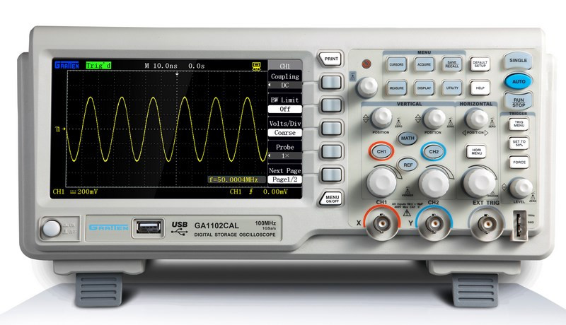

# 1: Introduction to VCV Rack and Generating Voltage

This chapter will teach you how to use the oscilloscope as a tool for understanding signals, how to think about voltage, and help you become comfortable patching modules together in *[VCV Rack](https://vcvrack.com)*, an open-source digital environment which closely emulates Eurorack-format modular synthesis (including direct ports of many analog and digital Eurorack modules).  

While VCV Rack is a digital environment, we will continue to talk about the signals as analog voltages, since the environment is designed to emulate Eurorack modular synthesis.

In these first two labs, we will look at a critical tool for understanding *signals*: the *oscilloscope*.  An oscilloscope allows you to visualize the voltage level of a signal in order to understand how the signal is actually changing over time.  Understanding how a signal changes over time is critical to understanding how the signal is affecting any of the other modules it might be connected to.  We will also look at two simple signal generator modules which output constant voltages.  The magnitude or *level* of the constant voltage can be set by a knob.

When you are ready, move on to the [next chapter](../Chapter-02/chapter02.md)!

## Labs

So, let's begin!  Right-click (or alt/opt-click) on the links below; then click `Save as ..` to download the two VCV Rack labs.  Make sure you are logged in to the class VCV Rack account before you begin: use credentials `itmspw@gmail.com` (password: `synthesis`) and hit `Library > Update plugins` before you begin.  Once you are logged in and have downloaded the labs/updated your plugins, double-click the first lab in your file browser, or open it using VCV Rack's `File > Open` dialog.  

[Lab 1.1: Generating Voltages and Viewing with the Oscilloscope](https://raw.githubusercontent.com/signal-flux/SFxPW-Intro-to-Modular-Synthesis/master/Chapter-01/patches/lab_1_1_annotated.vcv) (`Right-click > Save as ...`)

[Lab 1.2: Oscilloscope Timescales](https://raw.githubusercontent.com/signal-flux/SFxPW-Intro-to-Modular-Synthesis/master/Chapter-01/patches/lab_1_2_annotated.vcv) (`Right-click > Save as ...`)

You can also go to this page and click download to get a .zip file containing all the labs for Chapter 1:

[Chapter 1 Labs (zip)](./patches/ch01_vcv_labs.zip)

## Additional Notes

If there is anything you are having trouble understanding in the labs, see if the notes below help! If you want more guidance, comment in the slack, or shoot Izzy or Sam a message!

### Offsets

We say that the voltages output by the two modules are *constant* because they stays at the same level, so long as we do not change the knob positions. These constant voltages are known as *DC offsets*, or just *offsets*.  We will discuss why they are called this later in more detail, but for now, it is enough to consider that adjusting the knob just seems to *offset* the voltage up and down. We say that the **Unipolar Offset** generates *unipolar* voltage because it only outputs positive voltage, while the **Bipolar Offset** output is *bipolar* because it outputs both positive and negative voltage.

### Oscilloscopes

What about a **Scope**? What does it do? As indicated by the root word "scope", oscilloscopes visualize voltages that change over time.  The X-axis of the oscilloscope screen is time, while the Y-axis is the voltage level.  The top half of the screen corresponds to positive input voltages, and the bottom half of the screen corresponds to negative voltages.  Each trace represents the level of the input voltage - the higher the trace, the higher the input voltage!

[Here's a nice video](https://www.youtube.com/watch?v=u4zyptPLlJI) from Sparkfun which goes over an analog oscilloscope!

When the input voltage is not changing, the **Scope** will just display a flat line at the height of the input voltage.  When a voltage increases, the line tracing the voltage moves up.  Similarly, if the input voltage decreases, the level of the line moves down.

When the input voltage changes, older values are displayed on the left of the screen, and newer values are displayed on the right.  In other words, the **Scope** will write the incoming voltage values onto the screen from left to right.  Once it reaches the right edge of the screen, it will either erase the whole screen and start over on the left side, or it will just reset to the left side and begin writing from left to right, leaving the old values in place until it overwrites them.

### Scope TIME scales

The **Scope**'s `Time` knob determines the scaling of the X-axis in the oscilloscope viewfinder; since the X-axis is just time, the `Time` knob thus determines the window of time for which you can see voltages on the **Scope**.  In other words, it determines how long it takes for the **Scope** to write values across the entire screen from left to right, before having to reset and start over on the left hand side.  As `Time` turns clockwise, it takes less and less time to complete a single frame, meaning you can't see as far back into the past, but you can see very fast changes much more clearly.

Alternatively, you can think of the `Time` knob as determining how frequently the **Scope** completes a single frame.  The greater the value of `Time`, the greater the frequency at which it completes a frame (which is the same as saying it takes less time to complete a single frame).  

`Time` allows you to zoom in and out along the X-axis, giving you better understanding of how voltages are changing in the microscopic, mesoscopic, and macroscopic scales.  If you imagine a time line of history with important events marked on it, this knob determines if the scale of the timeline you are observing is geological eras, millenia, centuries, months, weeks, days, hours, minutes or seconds!  The more zoomed in you are, the easier it will be to see very quick changes, but the harder it will be to see changes across longer time scales. Try repeating the steps above with this in mind.

We will cover the other parameters of a **Scope** in subsequent lessons.

### VCV Rack Cable LEDs

In addition to using the oscilloscope to view the level of a voltage, VCV Rack conveniently displays a color at either end of a cable to visualize the voltage, as indicated by step (3) above.  When the color is green, it indicates the cable is carrying a positive voltage.  When it is red, indicates the cable is carrying a negative voltage.  The brightness of the color corresponds to the magnitude.

