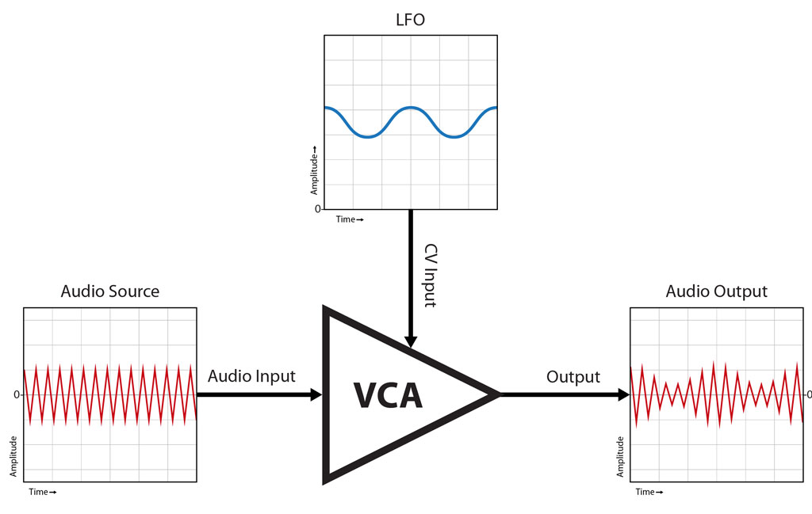
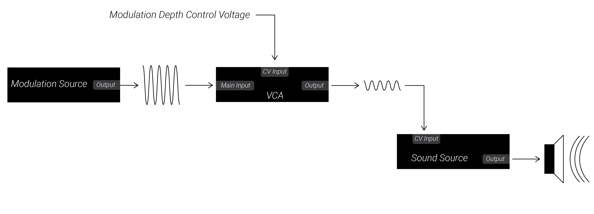

# 3: Voltage-Controlled Amplifiers

This chapter will introduce you to another core building block of synthesis: the voltage-controlled amplifier.  We previously used attenuators to change the amplitude of signals, however we could only use the knobs of the attenuators to set the amplitude of the incoming voltage.  The primary purpose of the VCA is to use the voltage level of one input signal to control the amplitude of another input signal.  This allows them to control the loudness of audio signals or the modulation depth of control voltage.

When you are ready, move on to the [next chapter](../Chapter-04/chapter04.md)!

## Labs

Right-click (or alt/opt-click) on the links below; then click `Save as ..` to download the two VCV Rack labs.  Make sure you are logged in to the class VCV Rack account before you begin: use credentials `itmspw@gmail.com` (password: `synthesis`) and hit `Library > Update plugins` before you begin.  Once you are logged in and have downloaded the labs/updated your plugins, double-click the first lab in your file browser, or open it using VCV Rack's `File > Open` dialog.  

[Lab 3.1: Voltage-Controlled Amplifiers and Loudness](https://raw.githubusercontent.com/signal-flux/SFxPW-Intro-to-Modular-Synthesis/master/Chapter-03/patches/lab_3_1_annotated.vcv)

[Lab 3.2: Voltage-Controlled Amplifiers and Modulation Depth](https://raw.githubusercontent.com/signal-flux/SFxPW-Intro-to-Modular-Synthesis/master/Chapter-03/patches/lab_3_2_annotated.vcv)

Or, go to this page to download a .zip file containing all the labs for Chapter 3:

[Chapter 3 Labs (zip)](./patches/ch03_vcv_labs.zip)

## Additional Notes

If there is anything you are having trouble understanding in the labs, see if the notes below help! If you want more guidance, comment in the slack, or shoot Izzy or Sam a message!

Here's a fun preview of lots of ways VCAs can be used in modular synthesis, made by Mylar Melodies: 

[Why you can never have two many VCAs](https://www.youtube.com/watch?v=JKqcQxLjno0)

### More on VCAs

A *voltage-controlled amplifier*, or *VCA*, takes an input signal and sets a new amplitude for it based off of a different *control voltage* (or *CV*) input. In other words, it is just like an attenuator, but rather than using a knob to set the amplitude of the signal passing through it, it uses another voltage source to control the amplitude of the original input signal!  

If you recall from the lesson on attenuverters, attenuation or amplification of a signal (i.e. decreasing or increasing its amplitude) is just performed by multiplying the signal by a number.  In the case of the attenuverter, when the knob was fully CW, it was as if this "control number" to multiply the original signal was `1`, and the original signal passed through unchanged at its original amplitude since multiplying any number by `1` leaves the original number unchanged.  Similarly, when the knob was at noon, it was as if the "control number" was `0`, meaning the output voltage was always `0V`, regardless of the input voltage, since anything times `0` is always still `0`.  Intermediate knob positions scaled the the input signal down proportionally.  

Similarly, a VCA multiplies its input signal by another number determined by the control voltage.  In the case of **VCA-1**, the input signal is multiplied by `0` when the control voltage is `0V`, resulting in output of `0V` at all times, regardless of the input voltage.  The input voltage is multiplied by `1` when the control voltage is `10V`, resulting in the input signal passing through the VCA unchanged.  When the control voltage is `5V`, the input is multiplied by `0.5`, resulting in the amplitude of the output voltage being precisely half of the original voltage.  Other intermediate control voltages similarly scale the input voltage proportionally before sending it on to the output!  

Not all VCAs will have this exact mapping, where a `10V` control voltage corresponds to multiplying the signal by `1`.  Some VCAs might use `5V` as the point where a signal passes through unaltered (i.e. is multiplied by `1`); in this case, `Vcv` would be divided by `5` rather than `10` before being multiplied by `Vin`.  

Similarly, not all VCAs will treat negative control voltages the same as sending in `0V`.  Other VCAs might be able to multiply the input signal by negative numbers when negative control voltages are sent in, inverting it.  

### Controlling Loudness

Recall from the previous lessons that when an audio rate signal is patched to a speaker, its amplitude determines its loudness.  Suppose you patch a VCO to the input of a VCA.  When the output of the VCA is patched to the speaker, and an LFO is used as the control voltage for opening and closing the VCA, we hear the VCO's volume fade in and out according to the LFO's voltage!  As the LFO output voltage gets greater, the VCO gets louder as its amplitude increases.  As the LFO falls back to `0V`, the VCO (after passing through the VCA) gets quieter since the control voltage LFO into the VCA is decreasing.  

VCAs then are crucial for being able to create a "note", or really any sonic event besides a drone!  If we do not want an audio signal to be playing at all times, we can simply patch it through a VCA.  Whenever we went a sonic event to happen, all we need to do is open the VCA using control voltage!   In future lessons, we will look at using envelope generators to create control voltage signals which open and close a VCA on command using trigger pulses, rather than using an LFO to endlessly open and close the VCA in a cycle.  Using a stream of triggers to fire off an envelope generator which opens a VCA processing an an audiorate oscillator then will be how we create streams of note events, just like a guitarist plucking a string repeatedly!  We will need other tools to set the pitch of the oscillator, just like the guitarist must use their other hand to set the length of the string, and thus pitch of the note played.

### Controlling Modulation Depth

VCAs can also be used to process control voltage before the control voltage is sent on to a destination parameter.  By setting the amplitude of the control voltage passing through it, a VCA allows you to dynamically change the *modulation depth* without having to use an attenuator knob and your hand!  It allows you to use one voltage (the VCA CV input) to set the amplitude of another control voltage (the VCA input) before it is passed to the output.  As such, it allows you to automatically change *over time* how much modulation occurs in a patch.  This enables you to do an enormous number of creative things which we will explore in the coming weeks!  Mylar Melodies video (linked above) does a great job of demonstrating some of them.  

