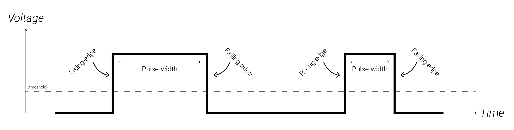
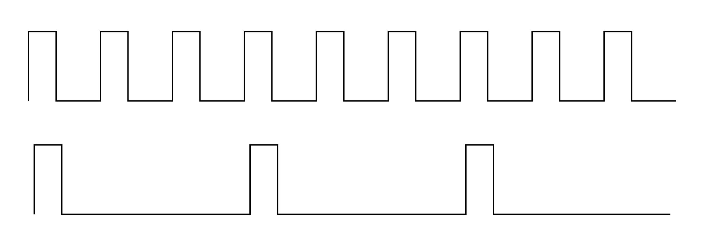
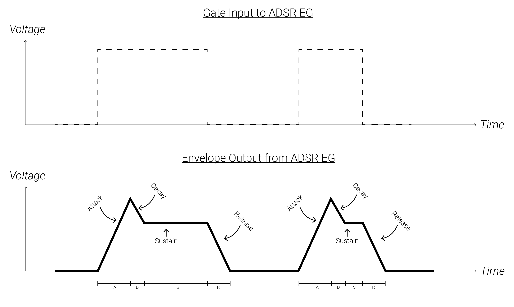
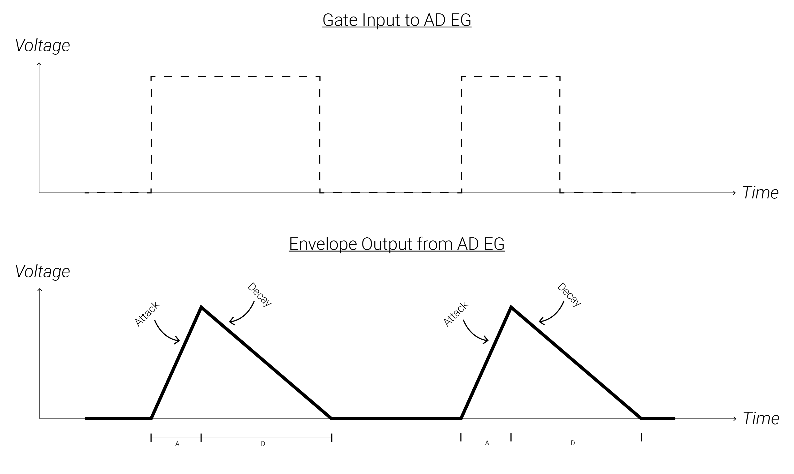
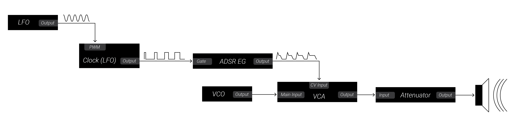
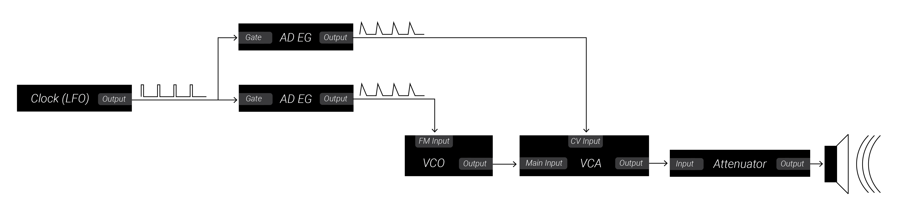

# 4: Triggers, Gates, Clocks, and Envelopes

This chapter will introduce you to the key ingredients for creating events in the modular world: triggers, gates, clocks, and envelopes. 

When you are ready, move on to the [next chapter](../Chapter-05/chapter05.md)!

## Labs

Right-click (or alt/opt-click) on the links below; then click `Save as ..` to download the two VCV Rack labs.  Make sure you are logged in to the class VCV Rack account before you begin: use credentials `itmspw@gmail.com` (password: `synthesis`) and hit `Library > Update plugins` before you begin.  Once you are logged in and have downloaded the labs/updated your plugins, double-click the first lab in your file browser, or open it using VCV Rack's `File > Open` dialog.  

[Lab 4.1: Gates](https://raw.githubusercontent.com/signal-flux/SFxPW-Intro-to-Modular-Synthesis/master/Chapter-04/patches/lab_4_1_annotated.vcv)

[Lab 4.2: Attack-Decay-Sustain-Release Envelope Generators](https://raw.githubusercontent.com/signal-flux/SFxPW-Intro-to-Modular-Synthesis/master/Chapter-04/patches/lab_4_2_annotated.vcv)

[Lab 4.3: Clocks and Pulse-Width](https://raw.githubusercontent.com/signal-flux/SFxPW-Intro-to-Modular-Synthesis/master/Chapter-04/patches/lab_4_3_annotated.vcv)

[Lab 4.4: Triggers and Attack-Decay Envelope Generators (Kick Drum Case Study)](https://raw.githubusercontent.com/signal-flux/SFxPW-Intro-to-Modular-Synthesis/master/Chapter-04/patches/lab_4_4_annotated.vcv)

Or, go to this page to download a .zip file containing all the labs for Chapter 4:

[Chapter 4 Labs (zip)](./patches/ch04_vcv_labs.zip)

## Additional Notes

If there is anything you are having trouble understanding in the labs, see if the notes below help! If you want more guidance, comment in the slack, or shoot Izzy or Sam a message!

### Gates, Triggers, and Pulse Width

Gates and triggers are both used to manage events in the modular world.  They give instructions to other modules, like telling an envelope generator to "start" or "stop," or telling a sequencer "advance to the next step."  So what is the difference between the two?  

You can think of gates like a red light/green light system: gates can be *high* ("green light": do stuff) or *low* ("red light": stop doing stuff).  Meanwhile, triggers are like a snap of the fingers - they just say "go!" or "do it right... now!" (whatever *it* may be).  

A "pulse" is a voltage signal which starts at 0V, spikes up to a high voltage, stays there for some amount of time (the *pulse-width*), and then immediately drops back to 0V.  Gates are pulses where the pulse-width matters, while triggers are pulses where the pulse-width does not matter, only the rising-edge.

To answer this question in more precise detail, it is important to recall that control voltage does not "mean" anything on its own.  CV only takes on meaning when sent to a CV input which *interprets* the CV signal and does something with it.  For instance, a "gate" signal can be sent to the frequency input of an oscillator.  It does not really behave as a gate in this case, since in fact, the maximum and minimum voltage of the gate will matter to the frequency input of the VCO, and there is no "threshold" that it crosses to signal to the receiving module that it has entered the "high/low" state. 

Really, gates only become true gate signals when sent to an input which expects to receive gates.  Such an input would have a *threshold* which specifies when a received signal is in the high state, and when it is in the low state (*NB: this means that you can actually use any signal as gate - even a sine wave LFO - since any signal can cross back and forth over a threshold*).  The threshold level may change from module to module, but is generally around +0.5V to +1.5V.

The point in time where a gate crosses over the threshold is known as the *rising-edge*.  The point where a gate falls below the threshold is known as the *falling-edge.* The amount of time a gate stays above the threshold is known as the *pulse-width*.  (*NB: Some modules may have different thresholds for the rising-edge and falling edge - this is known as "hysteresis"*).

Modules which expect to receive gates will carry out one action on the rising-edge: e.g. an ADSR envelope generator initiates its attack phase when an input gate signal goes high.  The receiving module will continue performing some action as long as the gate is held high.  Our ADSR envelope generator will remain in its sustain phase until the gate goes low.  When the gate does finally go low, the module will carry out some other action.  For instance, an ADSR envelope generator will leave its sustain phase and enter its release phase, sloping from the sustain level down to 0V.  

However, some modules only expect to receive *triggers*. These modules only care about one of the two edges - the rising-edge.  These modules carry out one action whenever an input signal crosses over the rising-edge, like initiating a single envelope with just an attack and decay phase, or advancing a sequencer one step.  So, really any gate signal can be used as a trigger!  Triggers are just special types of gates where the only thing that matters is the initial moment when the trigger says "go!"

Gates are pulses where the pulse-width matters, while triggers are pulses where the pulse-width does not matter, only the rising-edge.

Sometimes, you may hear someone say something like "this module only generates triggers, not gates."  Really what they mean to say is "this module only generates pulses of voltage with extremely short pulse-width, so the signals are only suitable to use as triggers and not as gates." Often times, when people are referring to an input which expects triggers, they may still refer to it as a gate input!  Whenever you want to know what it really is, just always remember to ask yourself if the length of the gate matters or not. 

### Gates/Triggers vs. Clocks

So what about clocks?  What are they? How do they relate to gates and triggers?

Clocks are signals made up of streams of gates (or triggers) that are sent at a (usually) constant rate.  Some modules may need clock signals to operate. For instance, a sequencer usually expects a clock at a constant rate to drive it forward through each step of the sequence, though many sequencers have built in clocks.  Another example of a module which expects to receive clock signals is a *clock divider*: clock dividers have one clock input and several clock outputs, numbered 1,2,3,...,*n*; each output generates one pulse for every 1,2,3,...,*n* input pulses, respectively.

Deriving new rhythms based off a source clock stream is known as *clock modulation*.  We will talk more about this in future lessons!

### Analog vs. Digital

Most signals in the modular world are "continuous" a.k.a. *analog*: they can take on any value between the minimum and maximum allowed voltages, and the exact value of the voltage matters.  For instance, a VCA will change the volume of a signal passing through it to different levels if it receives a control voltage of +3.4V or +3.5V.

Gates are special types of signals in the modular world. Since they are only meant to signal when to start or stop a process, the actual specific voltage level does not matter.  Even though they are still carried along patch cables as analog electrical voltage (as opposed to digital information stored in e.g. computer), they are not "analog" signals in the sense that there are only two possible states for a gate signal: *high* and *low*.  The actual voltage level of either state does not matter.  The only thing that matters is whether the gate signal is above or below a *threshold*.  

When a signal can only be in one of a finite number of discrete states, then the signal is said to be *digital*.  When that finite number is limited to just two possible states, we say that the signal is *binary* or *Boolean.*  So, since gate signals can only ever be *high* or *low*, they are "digital" signals, even though they are carried as analog electrical voltages along patch cables. 

You can think of the word "digital" as meaning "having a finite number of possible discrete choices, measurements, or meanings."  For example, a coin toss and a roll of the dice are both digital events because in each, there are a finite number of discrete possible outcomes.  Similarly, counting the number of students in our class is a digital measurement, since the possible measurements are discrete (e.g. 1, 2, 3, 4 are all possible, but none of the infinite number of decimals/fractions between the counting numbers).

You can think of the word "analog" as meaning "having possibilities that form a continuous spectrum or range of possible values, measurements, or meanings." Some simple examples include temperature, length, duration.

### ADSR vs AD Envelope Generators

ADSR and AD envelope generators are a great example of the difference between a gate and a trigger.

An attack-decay-sustain-release (ADSR) envelope generator (EG) expects a *gate* input.  Normally the ADSR EG's output rests at 0V.  As soon as its gate input goes high, it begins the attack phase and ramps from its minimum value to its maximum (usually somewhere from +5V to +10V, depending on the module).  As soon as it reaches its maximum, it begins decaying to its sustain level; once it reaches the sustain level, it will it will hold as long as the input gate remains high.  As such, the amount of time spent in the sustain phase is controlled by the gate length, not the envelope generator itself (unlike the other phases).  As soon as the gate goes low, the envelope releases from the sustain level and falls back to 0V (its resting voltage).  It then waits for another gate signal.  The diagram below illustrates how an envelope generator responds to gates.  Notice that the different pulse-widths result in envelopes of different lengths.

Usually, if the input gate goes low before the EG has completed the decay phase, it will skip from its current phase to the release phase and fall from its current level.  If the input gate goes high during the release phase before the envelope has reached 0V, the envelope jumps back to the attack phase and rises from its current level.

Typically, an ADSR envelope generator will have four knobs: 3 knobs to control the attack, decay, and release times, and one knob to control the sustain level (remember, sustain length is controlled by the input gate's pulse-width).  An ADSR EG may also have CV inputs for each of the four parameters

[Check out this web demo](https://www.desmos.com/calculator/5ax8nfzyj2) to visually get a better grasp of an ADSR EG controlling a VCA (as in Lab 4.3).

An AD EG on the other hand is not sensitive to the pulse-width - it treats all gate inputs as mere triggers.  When it receives a trigger, it ramps up from 0V to its maximum voltage in the amount of time determined by the attack parameter, and then immediately ramps back down to 0V in the amount of time determined by the decay parameter.  The graphs below illustrate this; note that the envelopes remain identical despite gates with different pulse-widths.

## Block Diagrams

### Lab 4.3: Gates, Clocks, and Pulse Width

We used one sine wave LFO to modulate the pulse-width of our Square wave clock.  Since the square wave clock was exciting an ADSR envelope generator, changing the pulse-width of the clock changed the length of the sustain phase for each envelope.

### Lab 4.3: Gates, Clocks, and Pulse Width

This patch resulted in a nice kick drum sound when the oscillator was tuned to a low pitch and envelopes with very instant attacks were used.  Adjusting the FM attenuator on the oscillator allowed us to control the punchiness of the kick and adjusting the decay time of the pitch envelope allowed us to control the snappiness of it.  Adjusting the decay time of the amplitude envelope allowed us to control how much of the rumbling sine wave tail passed through.

