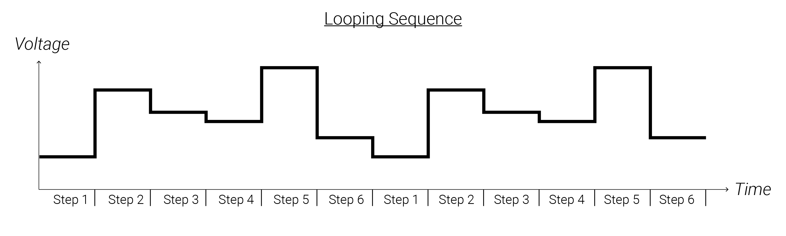

# 5: Sequences, Quantizers, Scales, and V/Oct

This chapter will introduce you to a critical concept for controlling pitch in a precise manner: the V/Oct tuning system.  It will also go over sequencers, which are essential tools for composing on the meso-time scale.  It will also introduce you to important music theory concepts, like octaves, intervals, scales, and root notes.

When you are ready, move on to the [next chapter](../Chapter-06/chapter06.md)!

## Labs

Right-click (or alt/opt-click) on the links below; then click `Save as ..` to download the two VCV Rack labs.  Make sure you are logged in to the class VCV Rack account before you begin: use credentials `itmspw@gmail.com` (password: `synthesis`) and hit `Library > Update plugins` before you begin.  Once you are logged in and have downloaded the labs/updated your plugins, double-click the first lab in your file browser, or open it using VCV Rack's `File > Open` dialog.  

[Lab 5.1: Sequencers](https://raw.githubusercontent.com/signal-flux/SFxPW-Intro-to-Modular-Synthesis/master/Chapter-05/patches/lab_5_1_annotated.vcv)

[Lab 5.2: One Volt Per Octave (V/Oct)](https://raw.githubusercontent.com/signal-flux/SFxPW-Intro-to-Modular-Synthesis/master/Chapter-05/patches/lab_5_2_annotated.vcv)

[Lab 5.3: Quantizers, Intervals, and Scales](https://raw.githubusercontent.com/signal-flux/SFxPW-Intro-to-Modular-Synthesis/master/Chapter-05/patches/lab_5_3_annotated.vcv)

[Lab 5.4: Creating a Melodic Sequence](https://raw.githubusercontent.com/signal-flux/SFxPW-Intro-to-Modular-Synthesis/master/Chapter-05/patches/lab_5_4_annotated.vcv)

Or, go to this page to download a .zip file containing all the labs for Chapter 4:

[Chapter 5 Labs (zip)](./patches/ch05_vcv_labs.zip)

## Additional Notes

If there is anything you are having trouble understanding in the labs, see if the notes below help! If you want more guidance, comment in the slack, or shoot Izzy or Sam a message!

### Sequences

A *sequence* is a control voltage signal which *steps* through different voltage levels.  A sequence stays at each *step*'s voltage for some amount of time before advancing to the next step.  When it changes steps, it jumps instantaneously from the current step's voltage to the next step's voltage.  A rhythmic stream of triggers or a clock source is usually needed to advance the sequencer from one step to the next, though many times sequencers will have built in clocks.

Sequences often are made of a fixed number of steps (e.g. 16 steps) and advance in a loop: each time the sequence reaches its final step, it loops back around to its first step.  These sort of sequences can be thought of as a list of voltages, one for each step; usually, the user is able to "program" (set) the voltage level for each step.  This allows the user to pre-defined create compositional structures or changes; these may anything from a few bars of 16th notes to step steps which last entire minutes and control changes in processing for an entire movement.  Often sequences are used to control the pitch of sound generators, but they may be used to control any other parameter as well, like the cutoff of a filter or the amplitude of an LFO.  If a looping sequencer is capable of being driven at audio-rate (i.e. completing hundreds of loops through its steps per second), it can even be used as a wavetable oscillator (more on those in a future lesson)!

Other sequences may be *generative* instead of looping; this means that rather than stepping through a fixed collection of steps, they generate the value for each new step in real-time, following some process.  The process may be as simple as "choose a random voltage" or it may involve more complex techniques that allow for slowly evolving patterns, like linear feedback shift registers, or sample+hold modules with phasing LFOs as the data and clock source. We will explore some of these techniques in the coming weeks!	

Often, sequencers are driven by clocks generating pulses at constant rates, but they can also just as easily be driven by rhythmic pulses or completely irregular pulses! 

The sequence below goes to random voltage levels with each step and is driven by an irregular clock (notice the different durations of each step).

### Octaves, Intervals, and Pitch Classes

We already know that pitch corresponds to frequency; if we control the frequency of an oscillator, we can control its pitch.  Sequences then seem like useful tools for creating melodies!  But how do we decide which frequencies to use for each step?  How do we know which pitches might go well together? And once we do know, how can we make sure to set the oscillator to exactly the right frequency? To address these questions, we need to learn a little bit of music theory.

In general, how two pitches sound together is not determined by examining their absolute pitch (i.e. their individual frequencies), but rather by examining the relationship between their frequencies.  The relationship between their frequencies is not determined by the difference of the two frequencies, but rather by the ratio of their frequencies (*NB: the ratio of their frequencies is calculated by dividing the larger of the two by the smaller and then simplifying*).  The ratio of the two frequencies is known as the *interval* that separates the two pitches.  The larger the ratio, the larger the interval between the two pitches.  Instead of talking about the distance between two pitches as the difference of their frequencies, we talk about the distance between two pitches as the interval between them.  For instance, 150Hz and 225Hz form the same interval as 200 Hz and 300Hz, since they both form a ratio of 1.5:1.  Common intervals which show up often in music are given names, which you may end up learning as you progress in your musical explorations.  

There is one interval which you MUST memorize the ratio for, and that is the *octave*.  Two pitches are said to be an *octave* apart when their frequencies form a ratio of 2:1.  Any two pitches which form an octave work so incredibly well together, no matter what type of instrument is playing them and no matter what musical tradition is being performed that the two pitches are said to be the same note, just in different *registers* or *ranges*.  For instance, 100Hz, 200Hz, 400Hz, and 800Hz are all the same note despite being different pitches since each frequency is double the previous frequency.  These groups of pitches which form octaves together are known as *pitch classes*.  A piano for instance is made up of 88 pitches (88 keys) but just 12 pitch classes: the layout of the keys on a piano repeat in groups of 12.

We will also for convenience say that two frequencies whose interval is less than 2:1  are "within the same octave" (i.e. are less than an octave apart - we are using the word "octave" to refer to the range of frequencies covered by the interval above the lower frequency).  For instance, we would say that 100Hz and 150Hz are in the same octave because 150Hz is less than double 100Hz.  Additionally, we would say that C2, C3, and C4 are all the same note but from different octaves: any two pitches from the same pitch class are the same note but from different octaves.  

### One-Volt-per-Octave (V/Oct)

Now that you know about the octave, you can learn about how the pitch of oscillators (and other sound generators) can be controlled in a precise manner!  Since the most important interval is the octave, synthesizers usually use a tuning system known as *one-volt-per-octave*, or *V/Oct* for short, where very precise voltages are sent to an oscillator which shift its pitch up or down by specific intervals.  Any module or synthesizer which uses the V/Oct system will have a special frequency modulation input dedicated to V/Oct input signals - it will usually be labeled "V"/Oct" or "V/8,"" though it may sometimes simply be labeled "pitch".  This input will never have an attenuator attached to it, because it is crucial for the module to use the exact voltage which it receives.  How does it work?

The name should give it a way!  For every 1V increase at the V/Oct input, the oscillator will double its frequency - i.e. it will rise an octave.  When sending in 0V, the module will rest at its *root* frequency, exactly the same as if no cable were plugged to the volt per octave jack.  Changing the V/Oct input to +1V will double the oscillators frequency (one octave up from the root), +2V will quadruple it from the root (two octaves above the root), and so on. If -1V is sent to the V/Oct jack, the root frequency will be halved.  

The root frequency is usually set by knobs on an oscillator.  Often there are two knobs - one for *coarse* control (sweeping the frequency of the oscillator across several octaves), and one for *fine* control (sweeping the oscillator across a single octave).

Example 1: If the root frequency of an oscillator is 200Hz and +1V is sent to the V/Oct jack, the oscillator will be set to 400Hz, exactly one octave above.  Similarly, if -1V is sent to the V/Oct jack, the oscillator will be set to half its root frequency, 100Hz.

Example 2: Suppose that currently +1.3V is being sent to the V/Oct input on an oscillator and that it happen to be oscillating at 230Hz.  If you change the V/Oct signal to +2.3V, the oscillator will double its frequency to 460Hz since there was a 1V increase at the V/Oct input.

Notice that the oscillator does not change its frequency linearly in terms of frequency: a 1V increase at the V/Oct input does not create the same change in Hz every time. It depends on the current frequency.  It does change the frequency *exponentially* however!

Just like the octave corresponds to a 1V increase, each interval - aka ratio - corresponds to its own voltage level in the volt-per-octave tuning system!  So for the musically inclined, there is a specific voltage that corresponds to e.g. a major third.  Increasing an oscillator's V/Oct signal by that amount will always shift the oscillator up exactly by a major third!

For the mathematically inclined only!: The frequency *F* produced by a V/Oct voltage *V* and a root frequency *Fo* is given by *F=Fo x 2^V*.  

This can be arranged to convert intervals into voltages.  Solving for the ratio (aka interval): *F/Fo = 2^V*.  And then solving for *V*: *V=log_2(F/Fo)*.  

### Scales & Quantizers

A *scale* is a collection of intervals (usually less than one octave) to be referenced against a *tonic* or *root* note.  Here are different examples of scales using various notations to express the intervals used: 

Scale 1 = {root, major 2nd, major 3rd, perfect 4th, perfect 5th, major 6th, major 7th}

Scale 2 = {1x, 1.125x, 1.2x, 1.33x, 1.5x, 1.66x, 1.8x}

Scale 3 = {*shadja, rishabh, gandhar, madhyam, pancham, dhaivat, nishad}*.   

Scale 4 = {*do, re, mi, fa, so, la, ti*}

Scale 5 = {0V, +0.167V, +0.333V, +0.417V, +0.5833V, +0.75V, +0.833V}

The intervals are chosen so as to be musically or sonically interesting together.  When the intervals are paired with a tonic, they then define a collection of specific pitches (or frequencies).  All of the octaves below and above the specified pitches are included within the scale; alternatively, you can think of a scale paired with a tonic as defining a set of allowed pitch classes.  

Since all of these intervals correspond to very specific ratios, a scale can then be thought of as a collection of V/Oct voltages to choose from! Remember, V/Oct signals do not set oscillators to absolute frequencies - they move oscillators' frequency up and down by fixed ratios.  The tonic of a scale is set by tuning the oscillator to the desired frequency; meanwhile the V/Oct signal moves the oscillator's frequency to the other notes in the scale by shifting it up and down by specific intervals.

How can we ever possibly set a voltage to exactly the right level to correspond to a desired interval if the numbers are so precise for V/Oct signals?

Quantizers are the modular tool for the job!  A quantizer allows the user to set a scale, or collection of allowed intervals: these intervals define a list of V/Oct voltage levels.  The quantizer then takes an incoming voltage and shifts the voltage to the nearest voltage level which matches a V/Oct level from the specified scale (octaves are allowed).  This means that you just need to get your voltages close enough to the desired intervals and the quantizer will do the rest.  One of the joys of composing with modular synthesizers is working with quantizers.  You can send in LFOs, sequences, or anything else in and get some sort of musically related V/Oct pitch sequence out.  Modulating the signal going into the quantizer allows evolving melodies and sequences to emerge which remain within a scale: for instance, attenuating a looping sequence and offsetting it before it reaches a quantizer allows you to transpose the sequence and modify the range of pitches it travels over all while remaining in key.  Using mixers and VCAs to do this dynamically can result in an ever-evolving pitch sequence from a single looping sequence - and it remains in key!

## Block Diagrams

### Lab 5.4: Creating a Melodic Sequence

Notice that the Sequencer's second row feeds back to modulate the clock LFO's pulse-width.  Since the sequencer treats its clock input as a trigger input, the changing pulse-width does not affect the sequencer at all.  The clock's changing pulse-width does however affect the ADSR EG.  It changes each envelope's sustain length.  This means that one row of the sequencer can be used for pitch, while the other row of the sequencer can be used to control how long each note is sustained for.

