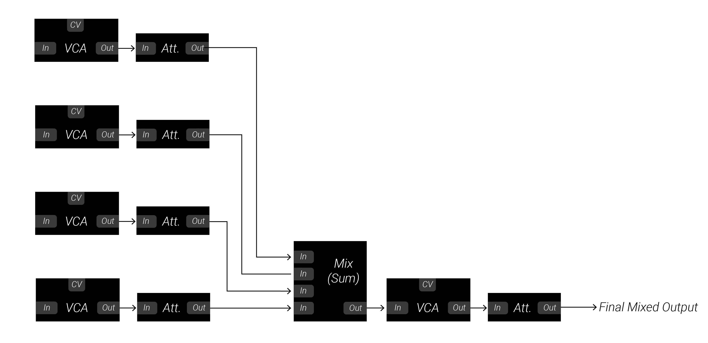
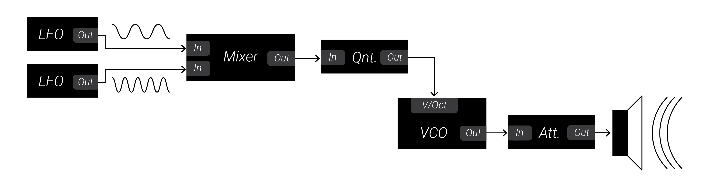
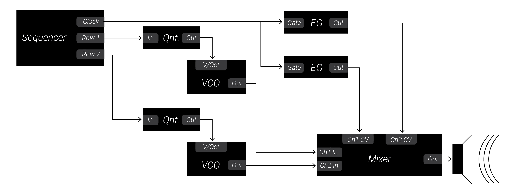

# 6: Mixers

This chapter will introduce you to mixers, which allow you to combine multiple different audio or CV signals into a single signal.  You will learn about layering sounds and making more complex CV modulation signals using mixers!

When you are ready, move on to the [next chapter](../Chapter-07/chapter07.md)!

## Labs

Right-click (or alt/opt-click) on the links below; then click `Save as ..` to download the two VCV Rack labs.  Make sure you are logged in to the class VCV Rack account before you begin: use credentials `itmspw@gmail.com` (password: `synthesis`) and hit `Library > Update plugins` before you begin.  Once you are logged in and have downloaded the labs/updated your plugins, double-click the first lab in your file browser, or open it using VCV Rack's `File > Open` dialog.  

[Lab 6.1: CV Addition](https://raw.githubusercontent.com/signal-flux/SFxPW-Intro-to-Modular-Synthesis/master/Chapter-06/patches/lab_6_1_annotated.vcv)

[Lab 6.2: Audio Mixing, Part 1](https://raw.githubusercontent.com/signal-flux/SFxPW-Intro-to-Modular-Synthesis/master/Chapter-06/patches/lab_6_2_annotated.vcv)

[Lab 6.3: Audio Mixing, Part 2](https://raw.githubusercontent.com/signal-flux/SFxPW-Intro-to-Modular-Synthesis/master/Chapter-06/patches/lab_6_3_annotated.vcv)

[Lab 6.4: Audio Mixing, Part 3](https://raw.githubusercontent.com/signal-flux/SFxPW-Intro-to-Modular-Synthesis/master/Chapter-06/patches/lab_6_4_annotated.vcv)

[Lab 6.5: A Generative Sequence](https://raw.githubusercontent.com/signal-flux/SFxPW-Intro-to-Modular-Synthesis/master/Chapter-06/patches/lab_6_5_annotated.vcv)

[Lab 6.6: Harmony Exercise](https://raw.githubusercontent.com/signal-flux/SFxPW-Intro-to-Modular-Synthesis/master/Chapter-06/patches/lab_6_6_exercise.vcv)

Or, go to this page to download a .zip file containing all the labs for Chapter 4:

[Chapter 6 Labs (zip)](./patches/ch06_vcv_labs.zip)

## Additional Notes

If there is anything you are having trouble understanding in the labs, see if the notes below help! If you want more guidance, comment in the slack, or shoot Izzy or Sam a message!

### Mixers as Signal Addition

Though mixers can provide many functions, their core feature is to combine multiple signals together by mathematically adding them.  When a mixer adds signals together without adjusting their amplitude at all before doing so, they are known as "unity mixers" because they leave each individual signal unchanged.

The table below gives an example of the output for a unity mixer given two inputs.

| Input 1 | Input 2 | Output |
| ------- | ------- | ------ |
| +1.0V   | +2.3V   | +3.3V  |
| -2.4V   | +3.6V   | +1.2V  |
| -4.0V   | -0.8V   | -4.08V |

### Mixers and Attenuation

Since it is so common to want to control the amplitude of the input signals before they are added into the output, many mixers have attenuators built in to the device which modify the amplitude of each signal before it gets added in to the output.  Some mixers may even have VCAs built in to them to allow voltage control over the amplitude of each signal in the mix.  Lab 6.4 demonstrates one such mixer, and the [block diagram below](#block-diagrams) illustrates its internal structure.

You can use [this web demo](https://www.desmos.com/calculator/5qi5o6rsjb) to play with the amplitude of three different waveforms and observe the final mix.

Since attenuators scale a signal using mathematical multiplication where the attenuator sets a scalar between 0 and 1, a mixer with attenuators can be expressed as such:

`Output = (Input1 x Attenuation1) + (Input2 x Attenuation2) + (Input3 x Attenuation3) + ... `

### Mixers and CV

When adding two CV signals together, the output always moves in the same direction as the inputs. The output voltage increases when either input voltage increases.  Similarly, the output voltage decreases when either input voltage decreases.  

This can be useful for instance when you want to control a parameter with two different behaviors.  For instance, you might want the parameter to slowly increase over the course of several minutes, which you would use an LFO for.  However, every few seconds, you might want an envelope to quickly spike the parameter and bring it back down.  You could use a mixer to combine your LFO and envelope so that both signals can modulate the target parameter.

### Mixers, Audio, and Gain

Mixers can also be used to combine audio.  They provide a critical tool for the synthesist: the ability to layer multiple sounds together.  It turns out when you add two signals together and then listen, you can hear both of the original signals simultaneously unchanged.  When using a unity mixer though, you cannot control the volume of each individual input.  Since this is such a common need, most mixer modules while have some form of attenuation built in to each individual channel before they are added into the final mix.  The attenuation applied to a signal is known as its *gain.*  Gain is expressed as a ratio of the output voltage to the input voltage.  So if an attenuator is set so that the output of a signal is half the amplitude of its input, the gain would be 0.5.  There are many units to express gain besides the mathematical ratio, the most common of which is the decibel.

## Block Diagrams

### Voltage Controlled Mixer Internal Structure

Each channel has a primary input, a control voltage input, and an attenuator.  The mixed signal also passes through a VCA and then an attenuator before reaching the final output.

### Lab 6.5: A Generative Sequence

A mixer combines two LFOs.  The mixed signal is fed to a quantizer.  The relative gain and speed of the LFOs as well as the final attenuation of the mix creates an evolving LFO pattern.  This pattern is quantized into a scale so that it became a sequence of V/Oct pitches for the VCO.  

### Lab 6.6: Harmonizing Oscillators Exercise

Each oscillator's pitch is controlled by one row of a sequencer which is processed by a quantizer into V/Oct pitches.  The sequencer's gate/clock output is used to drive two separate envelope generators, one for each oscillator.  These envelopes control the loudness of each oscillator directly at the voltage-controlled mixer.

