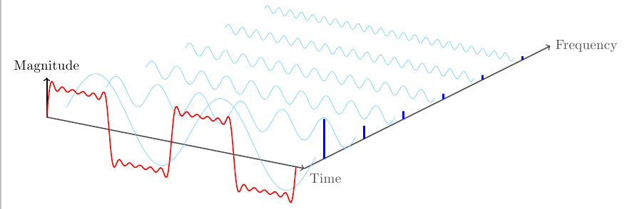
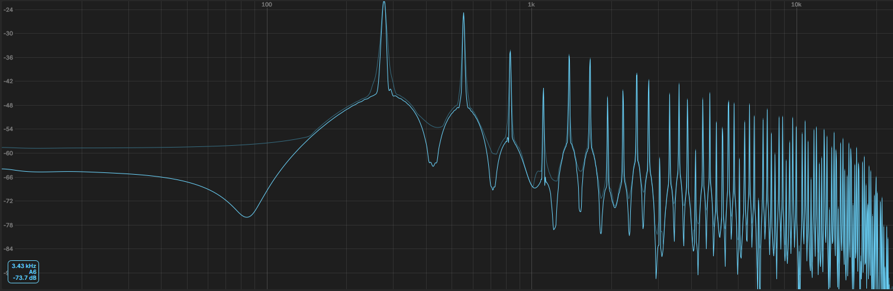
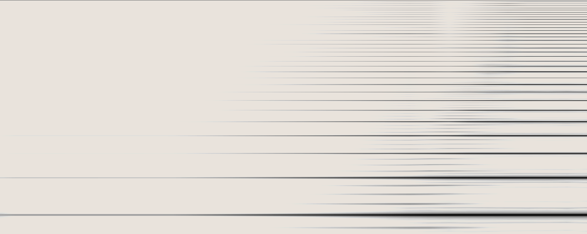
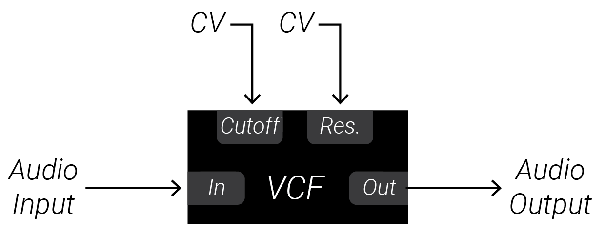
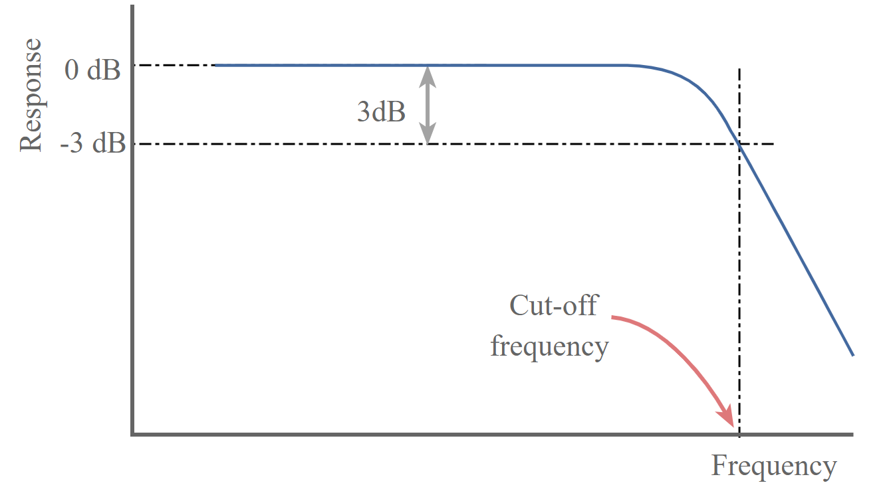
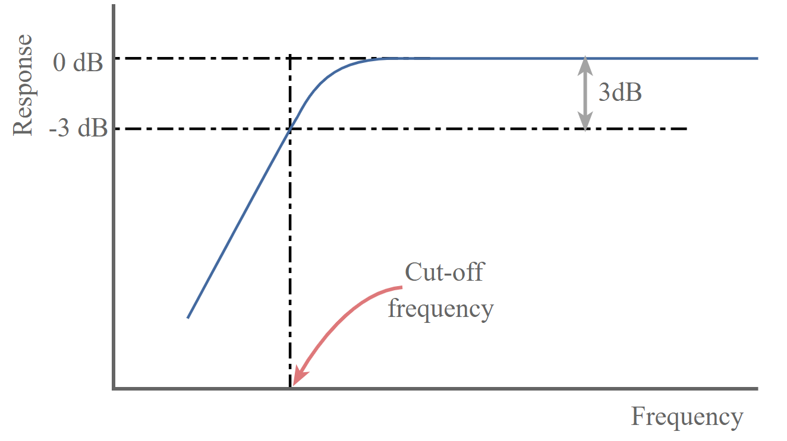
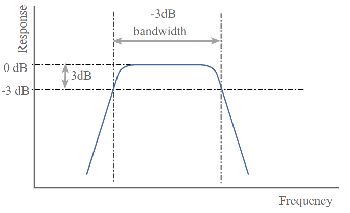
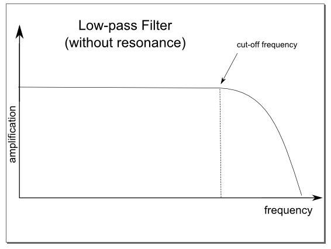
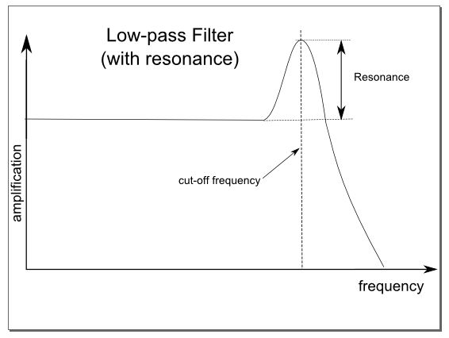

# 7: Spectrum, Waveshape, Filters, and Noise

This chapter will introduce you to... 

When you are ready, move on to the [next chapter](../Chapter-08/chapter08.md)! 

## Labs

Right-click (or alt/opt-click) on the links below; then click `Save as ..` to download the two VCV Rack labs.  Make sure you are logged in to the class VCV Rack account before you begin: use credentials `itmspw@gmail.com` (password: `synthesis`) and hit `Library > Update plugins` before you begin.  Once you are logged in and have downloaded the labs/updated your plugins, double-click the first lab in your file browser, or open it using VCV Rack's `File > Open` dialog.  

[Lab 7.1: Introduction to Filters](./patches/lab_7_1_annotated.vcv)

[Lab 7.2: Sequencing the Cutoff](./patches/lab_7_2_annotated.vcv)

[Lab 7.3: Envelope Generators and Cutoff](./patches/lab_7_3_annotated.vcv)

[Lab 7.4: Noise and Filters](./patches/lab_7_4_annotated.vcv)

[Lab 7.5: Analysis Exercise](./patches/lab_7_5.vcv)

You can also go to the page below and click download to get a .zip file containing all the labs for Chapter 7:

[Chapter 7 Labs (zip)](./patches/ch07_vcv_labs.zip)

## Additional Notes

If there is anything you are having trouble understanding in the labs, see if the notes below help! If you want more guidance, comment in the slack, or shoot Izzy or Sam a message!

### Fourier Analysis and Synthesis

The waveshape of an oscillator determines its timbre.  It turns out though that any periodic waveform (i.e. a repeating oscillation) can be created by mixing sine waves whose frequencies are all multiples of the original periodic waveform’s frequency.  By carefully controlling the amplitude of each of the sine waves, any other waveform can be created.

In other words, sine waves can be used as "building blocks" to create any other oscillation!  Starting out with sine waves and adding them up to create a more complex waveform is known as *Fourier synthesis* or *additive synthesis.*  Starting with a waveform and figuring out what sine wave "building blocks" would be needed to create the original waveform is known as *Fourier analysis*.  

The original frequency of the waveform is known as the *fundamental frequency*.  The integer multiples of the fundamental are known as *harmonics*.  The fundamental frequency is at the highest amplitude in the mix, and the harmonics are all at lower amplitudes.  If 100 Hz is the fundamental frequency, then the harmonics would be 200 Hz, 300 Hz, 400Hz, 500 Hz, and so on.  If 60 Hz is the fundamental, than the harmonics would be 120 Hz, 180 Hz, 240 Hz, and so on.

Use this [demo](https://www.desmos.com/calculator/tbmwhmxrx4) to explore mixing sine waves which are all integer multiples of the fundamental frequency.

Sounds which are more complex than  an oscillation, like a percussive hit or spoken language, may include many more sine waves that are not harmonic multiples of a fundamental frequency.  These are known as *partials*.

### Frequency Domain and Spectrum

So far, we have always been viewing voltages in the *time domain*: the x-axis is time while the y-axis measures voltage magnitude.  This allows us to see the waveshape of a sound as it shows the voltage rising and falling as time progresses.  On the other hand, the *frequency domain* is a new tool we can use to understand the harmonic content of a sound: the x-axis is frequency, while the y-axis measures the amount of energy at each frequency, i.e. the amplitude of the corresponding sine waves: in other words, it shows us which "building block" sine waves we need to mix together - and how much of each - in order to create another sound.

The image below shows the building block sine waves in light blue, the frequency domain graph in dark blue, and the time domain graph in red. Observe the gif above as well which animates this process.

A sound's *spectrum* is its representation in the frequency domain (i.e. its Fourier analysis, or the amount of energy at each frequency required to create the sound).

A *spectrogram* uses three dimensions to represent how a sound's spectrum changes over time.  The x-axis is time, the y-axis is frequency and the z-axis is energy (usually color is used for Z rather than depth).

### Voltage-Controlled Filters 

*Voltage-Controlled Filters* (a.k.a. VCFs) allow us to modify the timbre of a sound by acting on it in the frequency domain - that is to say, they allows us to get rid of some of the various "building block" sine waves that make up a sound!  Every filter has a *cutoff frequency*: the filter will eliminate building block sine waves above, below, or on either side of the filter depending on what type of filter it is.

The main types of filters:

*Lowpass* : eliminate frequencies above the cutoff ("pass" the low frequencies, leaving them unaffected)

*Highpass* : eliminate frequencies below the cutoff ("pass" the high frequencies, leaving them unaffected)

*Bandpass* : eliminate frequencies above and below the cutoff, passing only a narrow band around the cutoff.

Filters are not "perfect" in that they do not 100% reject frequencies directly beyond the cutoff.  The filter has a slope which determines how steeply frequencies beyond the cutoff are attenuated - i.e. the slope determines how far beyond the cutoff a frequency must be to be totally silenced.  

*Bode plots* show the filter response, aka which frequencies it leaves unaffected and how it starts attenuating frequencies beyond the cutoff.

Filters also have *resonance*, i.e. they actually amplify frequencies right at the cutoff instead of leaving them unchanged. When the resonance of a filter becomes great enough, the filter will begin to generate a sine wave oscillation at the cutoff frequency without any input signal at all! This is known as self-oscillation.

### Noise

Noise is the result of a signal which has energy at *all* frequencies.  The distribution of this energy (i.e. are the lower frequencies louder?  are all frequencies equal? etc) determines the character, or *color* of the noise.  Noise can be used as a sound source - it is particularly effective for percussive bursts, but it can also be used as a modulator to create chaotic changes in a parameter.  To create random step sequences, noise can be patched through a Sample and Hold module (more on that in a future chapter!)

*White noise*: Equal distribution of energy across all frequencies.  Since human ears do not actual perceive all frequencies equally, mid-range frequencies actually sound the lightest, given white noise a bright slightly harsher character (we are evolved to hear mid-range frequencies clearest due to human speech).

*Pink noise*: Frequencies are attenuated proportional to their frequency - i.e. higher frequencies are slightly attenuated.  It is like slightly lowpass filtered white noise, so it is a bit softer and gentler.

*Brown Noise/Red Noise*: More steeply filtered white noise.  Since higher frequencies are more attenuated than even pink noise, extra emphasis is placed on the low end.

*Blue Noise*: Opposite of pink noise.  Higher frequencies are amplified rather than attenuated.

### Wavefolding

[Check out this article](https://www.keithmcmillen.com/blog/simple-synthesis-part-8-wavefolding/) for a good overview!

