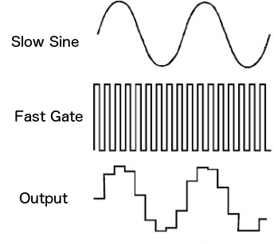

# 9: Sample & Hold and Slew Limiters

This chapter will introduce you to... 

When you are ready, move on to the [next chapter](../Chapter-10/chapter10.md)! 

## Labs

Right-click (or alt/opt-click) on the links below; then click `Save as ..` to download the two VCV Rack labs.  Make sure you are logged in to the class VCV Rack account before you begin: use credentials `itmspw@gmail.com` (password: `synthesis`) and hit `Library > Update plugins` before you begin.  Once you are logged in and have downloaded the labs/updated your plugins, double-click the first lab in your file browser, or open it using VCV Rack's `File > Open` dialog.  

[Lab 9.1: Sample and Hold/Track and Hold](./patches/lab_9_1_annotated.vcv)

[Lab 9.2: Slew Limiters](./patches/lab_9_2_annotated.vcv)

## Additional Notes

If there is anything you are having trouble understanding in the labs, see if the notes below help! If you want more guidance, comment in the slack, or shoot Izzy or Sam a message!

### Sample & Hold

A sample and hold (S/H) module has two inputs: a signal that is being sampled, and a trigger input that indicates when the first input should be sampled (aka frozen in place). When a trigger is received, the current voltage at the first input is sampled (measured) and held (stored), and presented at the output. This stable voltage is held until a new trigger is received. S+H can turn any signal into stepped sequence!  Pairing two LFOs with unequal frequencies to create a phasing, evolving sequence is a classic technique.  Another classic use of the S+H is to create random steps by patching noise into the S input.

A sample and hold module can also be used as a lo-fi sample rate reducer. Run audio through the S&H signal input and then run a VCO’s square wave output into the gate input. As you slow the VCO’s frequency you will hear an increased amount of sample reduction distortion applied to your audio signal.  [This video](https://www.youtube.com/watch?v=_tFVat6O3Jk) gives a great illustration of that technique, as well as many other S+H use cases!

### Track and Hold

T+H is a variation on the S+H that is gate-sensitive rather than trigger-sensitive.  As long as the input gate is held high, the module outputs the input voltage - in other words, it follows or *tracks* the input voltage.  As soon as the gate goes low though, it freezes and holds the current voltage level until another gate arrives.

### Slew Limiters 

A *slew limiter* smooths out a signal by limiting the rate of change of the output voltage. It is also known as a lag generator as well as an integrator. 

Slew limiters smooth out changes in a voltage. The output voltage is like a “laggy” version of the input voltage: it takes time to catch up (*slew*) to the input. 

A slew limiter has two main parameters: the *rise-time* and *fall-time*. When the input voltage increases, the output voltage rises to the new voltage in the amount of time specified by *rise*. When the input voltage decreases, the output voltage falls to the new voltage in the amount of time specified by *fall*. 

Some slew limiters may also have control over the curvature of the rise/fall segments.  This means that rather than rising or falling linearly at a constant rate, the slew limiter may rise/fall quickly at first and then slow down, or vice versa.  

SLs can be used to smooth out random sequences, create glissando/slides between pitch CV, and much more! SLs can even be used as lowpass filters since removing sharp transitions = rounding edges = removing HF content.

We can also use a slew limiter to convert a gate to an envelope signal. 
