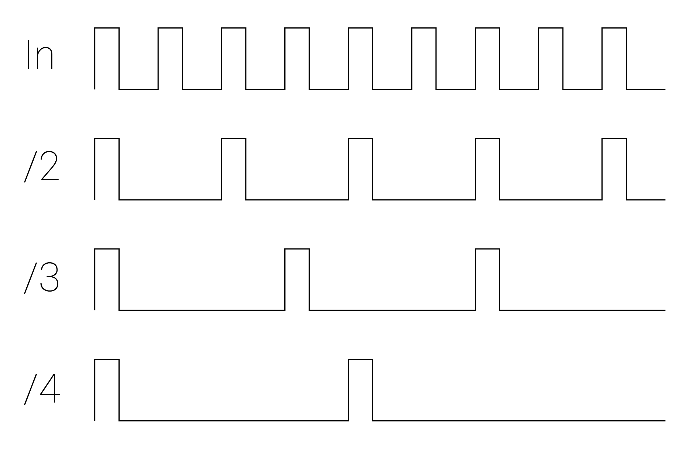

# 10: Clock Modulation

This chapter will introduce you to a few clock modulation techniques for generate new rhythms out of constant clock pulses!

When you are ready, move on to the [next chapter](..Chapter-11/chapter11.md)! 

## Labs

Right-click (or alt/opt-click) on the links below; then click `Save as ..` to download the two VCV Rack labs.  Make sure you are logged in to the class VCV Rack account before you begin: use credentials `itmspw@gmail.com` (password: `synthesis`) and hit `Library > Update plugins` before you begin.  Once you are logged in and have downloaded the labs/updated your plugins, double-click the first lab in your file browser, or open it using VCV Rack's `File > Open` dialog.  

[Lab 10.1: Clock Dividers](./patches/lab_10_1_annotated.vcv)

[Lab 10.2: Euclidean Rhythms](./patches/lab_10_2_annotated.vcv)

## Additional Notes

If there is anything you are having trouble understanding in the labs, see if the notes below help! If you want more guidance, comment in the slack, or shoot Izzy or Sam a message!

### Clock Modulation

*Clock modulation* converts a steady streams of gates/triggers, aka a clock, into a new pattern or "rhythm" of pulses which is somehow synchronized to the original clock.

### Clock Dividers

*Clock Dividers* output 1 pulse for every *n* input pulses.  Some clock dividers may automatically reset all outputs to a 0 count after the longest division pulses, while others will let all counters run independently.

Some clock dividers will allow you to change the division on each output, or even rotate the divisions between adjacent outputs.

### Euclidean Rhythms

*Euclidean rhythms* are a unique form of clock modulation generated by distributing a determined number of pulses as evenly as possible across a determined number of steps.

*Euclidean Length/Steps*: The number of steps in the pattern

*Euclidean Fill/Trigs*: The number of pulses in the pattern.

*Euclidean Offset/Rotation*: Determines where the first hit in the pattern occurs (shifts the pattern forward/backward in time)

Combinations of Euclidean rhythms are core elements of many musical traditions from all over the world.  

[Here's Godfried Toussaint's famous paper on Euclidean Rhythms](http://cgm.cs.mcgill.ca/~godfried/publications/banff.pdf).

[Here's a web demo (we did not make this one) which visualizes Euclidean Rhythms](https://dbkaplun.github.io/euclidean-rhythm/)

### Resets

*Reset* inputs allow you to set a sequencer or rhythm generator to the first step in its sequence or pattern.  This is very useful for synchronizing many different devices together, or for offsetting sequences/patterns in relationship to each other by sending different devices separate reset triggers. 